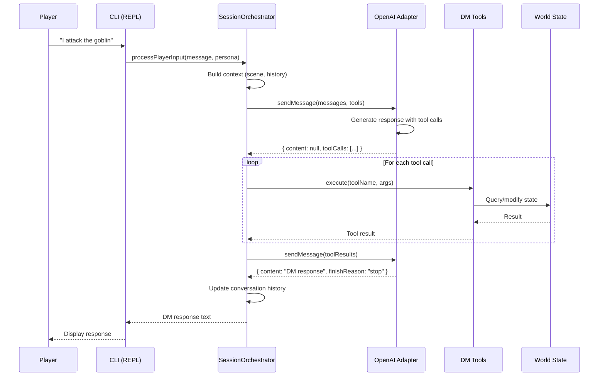
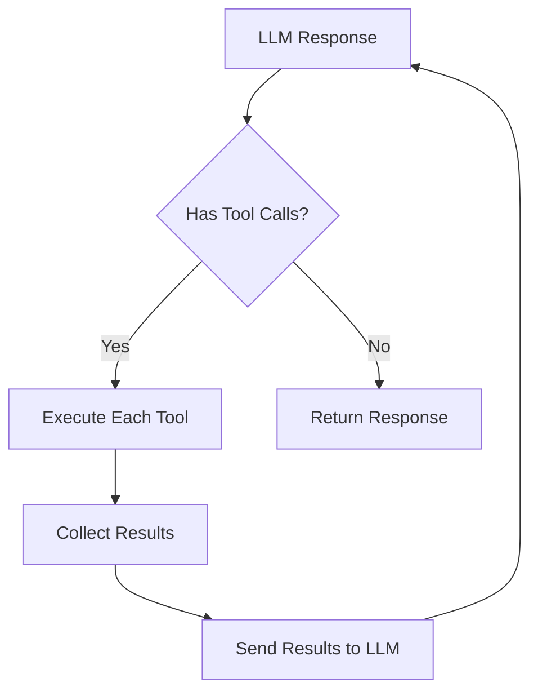
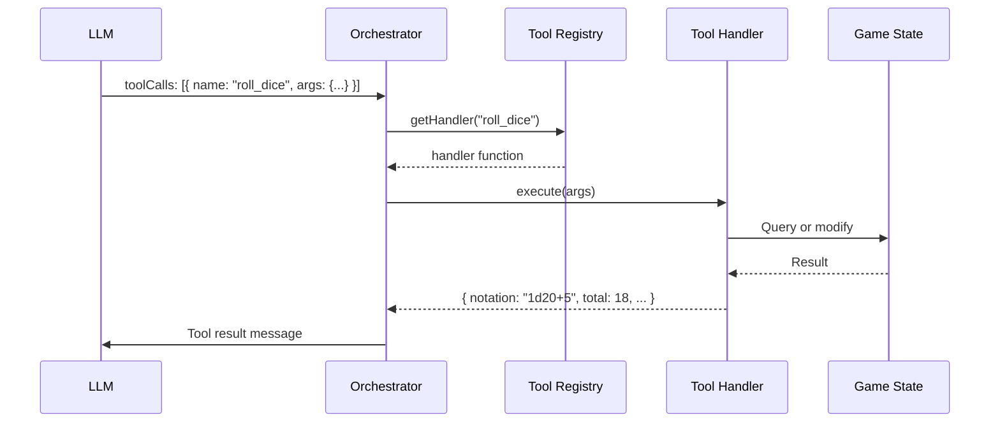
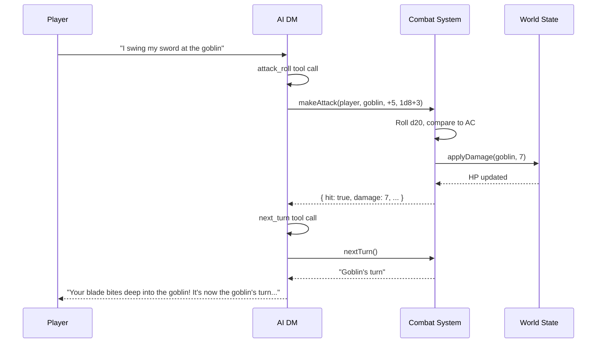
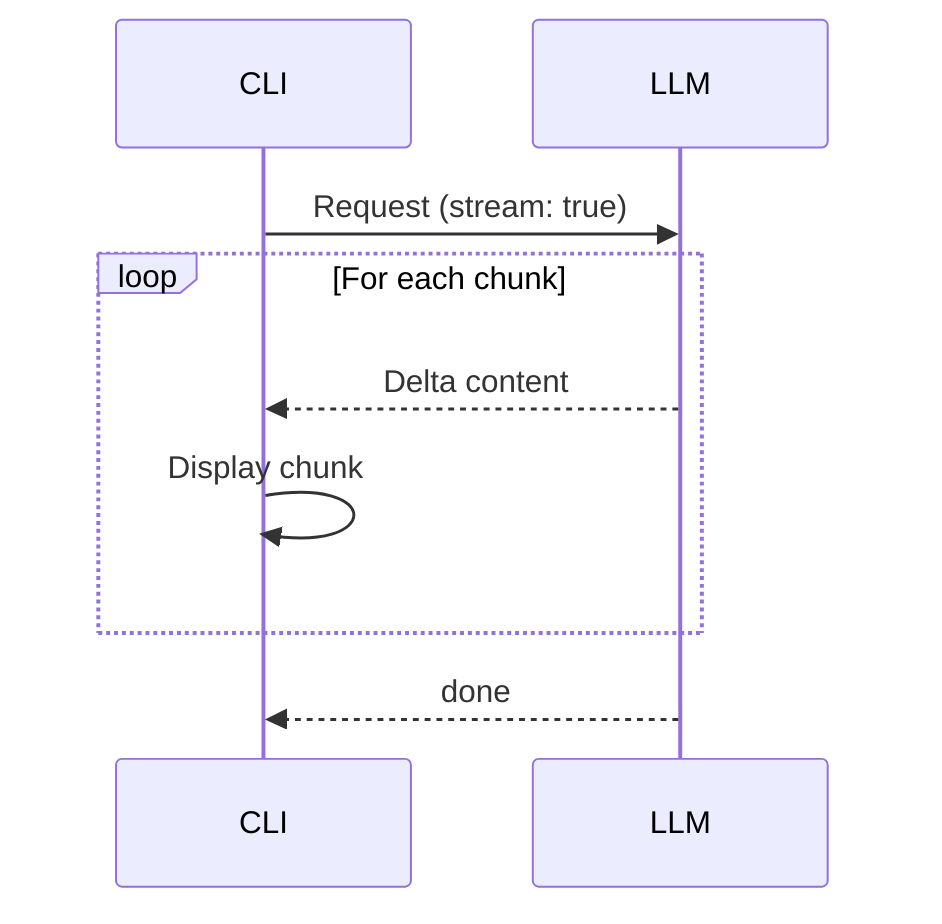
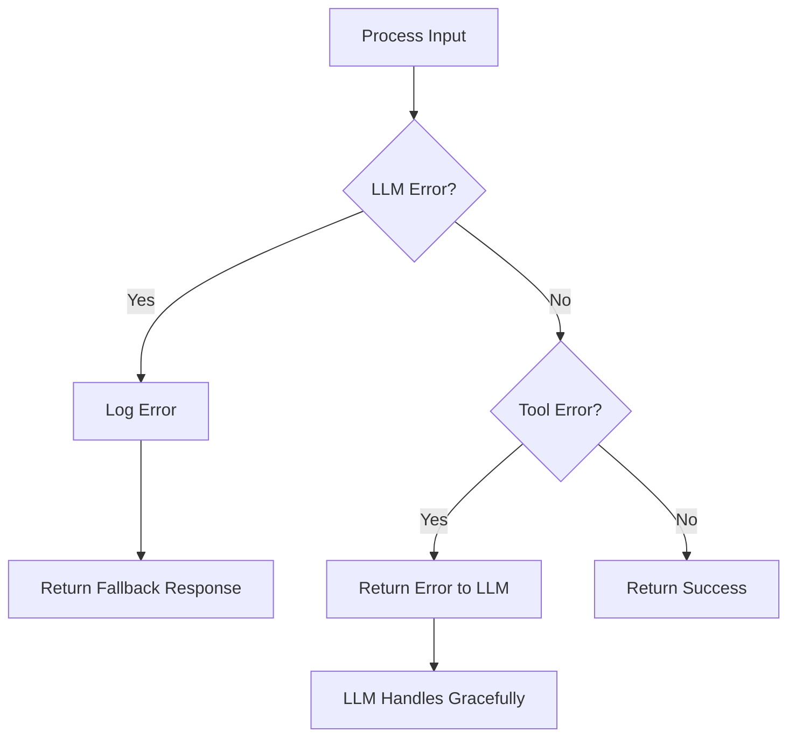

# Data Flow

This document describes how a player message flows through the Squadventure system from input to response.

## Message Lifecycle Overview



## Detailed Flow

### 1. Player Input

The REPL captures player input:

```typescript
// cli/src/repl.ts
const response = await this.orchestrator.processPlayerInput(
  trimmed,
  this.persona
);
```

### 2. Context Building

The orchestrator builds the LLM context:

```typescript
// application/src/session/orchestrator.ts
const messages: LLMMessage[] = [
  { role: 'system', content: this.buildSystemPrompt(persona) },
  ...this.conversationHistory,
  { role: 'user', content: playerInput }
];
```

The system prompt includes:
- DM persona definition and style
- Current scene description
- World state summary
- Player character stats
- Active combat state (if any)

### 3. LLM Request

The message is sent to OpenAI:

```typescript
// infrastructure/src/llm/openai-adapter.ts
const response = await this.client.chat.completions.create({
  model: this.model,
  messages,
  tools: this.formatTools(tools),
  temperature: this.temperature,
});
```

### 4. Tool Calling Loop

If the LLM requests tool calls, they're executed:



Tool execution example:

```typescript
// For an attack roll
const result = await toolHandler({
  attackerId: 'player-1',
  targetId: 'goblin-1',
  attackBonus: 5,
  damageNotation: '1d8+3',
  damageType: 'slashing'
});
```

### 5. State Updates

Tools may modify game state:

```typescript
// Combat attack modifies HP
combatManager.applyDamage(targetId, damage);

// Inventory changes
worldState.entities.set(item.id, item);
character.inventory.backpack.push(item.id);
```

### 6. Response Delivery

Final response is returned to the player:

```typescript
// Orchestrator returns final content
return response.content;

// REPL displays it
console.log(chalk.yellow.bold('DM: ') + chalk.white(message));
```

## Tool Call Flow Detail



## Combat Flow Example

A complete combat turn:



## Streaming (Optional)

For longer responses, streaming provides incremental output:



## Error Handling



## Related Documentation

- [Overview](Overview.md) - System architecture
- [LLM Integration](LLM-Integration.md) - OpenAI adapter details
- [DM Tools Reference](../api-reference/DM-Tools.md) - Tool documentation
