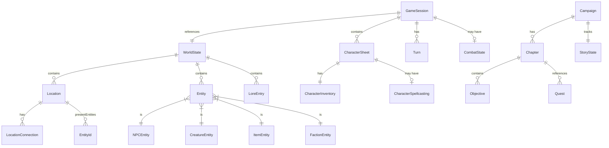

# Domain Model

This document describes the core domain entities and their relationships in Squadventure.

## Entity Relationship Diagram



## Core Entities

### WorldState

The root aggregate for world data.

```typescript
interface WorldState {
  id: string;
  name: string;
  description: string;
  locations: Map<LocationId, Location>;
  entities: Map<EntityId, Entity>;
  flags: Map<string, boolean>;
  counters: Map<string, number>;
  lore: LoreEntry[];
}
```

### Location

A place in the world that can be visited.

```typescript
interface Location {
  id: LocationId;
  name: string;
  description: CanonicalDescription;
  connections: LocationConnection[];
  presentEntities: EntityId[];
  ambiance: AmbianceProfile;
}

interface LocationConnection {
  targetId: LocationId;
  direction: string;
  description?: string;
  isHidden?: boolean;
  requiredCondition?: string;
}
```

### Entity Types

All things in the world that aren't locations.

```typescript
type EntityType = 'npc' | 'creature' | 'item' | 'faction';

interface BaseEntity {
  id: EntityId;
  type: EntityType;
  name: string;
  description: CanonicalDescription;
}
```

#### NPCEntity

Non-player characters with personality.

```typescript
interface NPCEntity extends BaseEntity {
  type: 'npc';
  personality: PersonalityProfile;
  knowledge: string[];
  motivation: string;
  attitude: 'friendly' | 'neutral' | 'hostile' | 'fearful';
  stats?: CreatureStats;
}
```

#### CreatureEntity

Monsters and creatures for combat.

```typescript
interface CreatureEntity extends BaseEntity {
  type: 'creature';
  stats: CreatureStats;
  attitude: 'friendly' | 'neutral' | 'hostile' | 'fearful';
}
```

#### ItemEntity

Physical objects that can be interacted with.

```typescript
interface ItemEntity extends BaseEntity {
  type: 'item';
  itemType: 'weapon' | 'armor' | 'consumable' | 'treasure' | 'misc' | 'tool' | 'gear';
  value?: number;
  weight?: number;
  magical?: boolean;
  properties?: string[];
  weaponDetails?: WeaponDetails;
  armorDetails?: ArmorDetails;
  consumableDetails?: ConsumableDetails;
}
```

### CharacterSheet

Player character data.

```typescript
interface CharacterSheet {
  id: EntityId;
  name: string;
  race: string;
  class: string;
  level: number;
  experience: CharacterExperience;
  background: string;
  stats: CreatureStats;
  inventory: CharacterInventory;
  spellcasting?: CharacterSpellcasting;
  hitDice: HitDice;
  deathSaves?: DeathSaves;
  features: string[];
  proficiencies: {
    armor: string[];
    weapons: string[];
    tools: string[];
    languages: string[];
  };
}
```

### GameSession

Active game state.

```typescript
interface GameSession {
  id: SessionId;
  worldStateId: string;
  personaId: PersonaId;
  currentScene: Scene;
  playerCharacters: CharacterSheet[];
  conversationHistory: Turn[];
  combat?: CombatState;
  playerProfile: PlayerProfile;
  createdAt: Date;
  updatedAt: Date;
}
```

### CombatState

Tracks active combat encounters.

```typescript
interface CombatState {
  isActive: boolean;
  round: number;
  participants: CombatParticipant[];
  currentTurnIndex: number;
}

interface CombatParticipant {
  entityId: EntityId;
  name: string;
  initiative: number;
  isPlayer: boolean;
  conditions: string[];
}
```

## Campaign Entities

### Campaign

Top-level campaign definition.

```typescript
interface Campaign {
  id: CampaignId;
  name: string;
  description: string;
  introduction: string;
  setting: CampaignSetting;
  levelRange: { min: number; max: number };
  chapters: Chapter[];
  worldStateId: string;
  storyState: StoryState;
  metadata: CampaignMetadata;
}
```

### Chapter

Major story segment.

```typescript
interface Chapter {
  id: ChapterId;
  number: number;
  name: string;
  synopsis: string;
  objectives: Objective[];
  keyLocations: LocationId[];
  keyNPCs: EntityId[];
  suggestedLevel: number;
  questIds: QuestId[];
  status: 'locked' | 'active' | 'completed';
}
```

### Quest

Standalone story unit with objectives.

```typescript
interface Quest {
  id: QuestId;
  name: string;
  description: string;
  questGiverId?: EntityId;
  objectives: Objective[];
  status: ObjectiveStatus;
  isMainQuest: boolean;
}
```

## Branded ID Types

All IDs use TypeScript branded types for type safety:

```typescript
type EntityId = string & { readonly __brand: 'EntityId' };
type LocationId = string & { readonly __brand: 'LocationId' };
type SessionId = string & { readonly __brand: 'SessionId' };
type CampaignId = string & { readonly __brand: 'CampaignId' };
// ... etc
```

Factory functions create branded IDs:

```typescript
import { createEntityId, createLocationId } from '@ai-dm/shared';

const npcId = createEntityId('npc-bartender');
const tavernId = createLocationId('loc-tavern');
```

## Zod Schemas

Runtime validation uses Zod schemas:

```typescript
import { z } from 'zod';

export const DiceRollSchema = z.object({
  notation: z.string(),
  results: z.array(z.number()),
  total: z.number(),
  purpose: z.string(),
});

export const AbilityCheckResultSchema = z.object({
  ability: z.enum(['strength', 'dexterity', 'constitution', 'intelligence', 'wisdom', 'charisma']),
  skill: z.string().optional(),
  dc: z.number(),
  roll: z.number(),
  modifier: z.number(),
  total: z.number(),
  success: z.boolean(),
});
```

## Related Documentation

- [Overview](Overview.md) - System architecture
- [Data Flow](Data-Flow.md) - How data moves through the system
- [Character System](../core-systems/Character-System.md) - Character details
- [World Model](../world-building/World-Model.md) - World structure details
