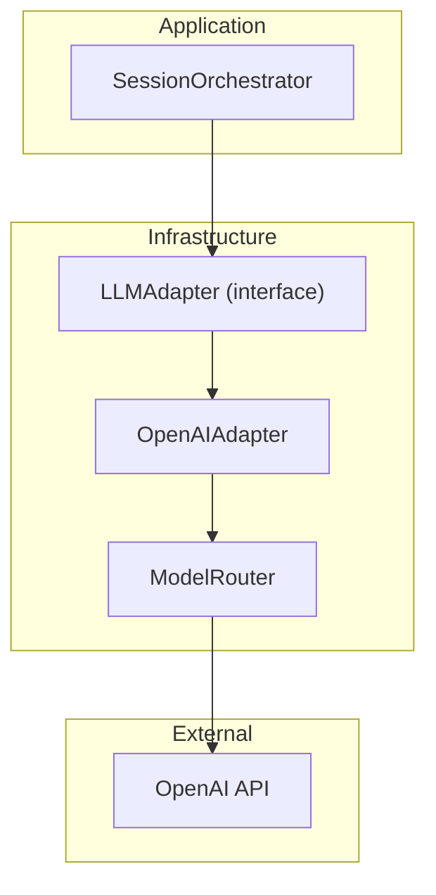
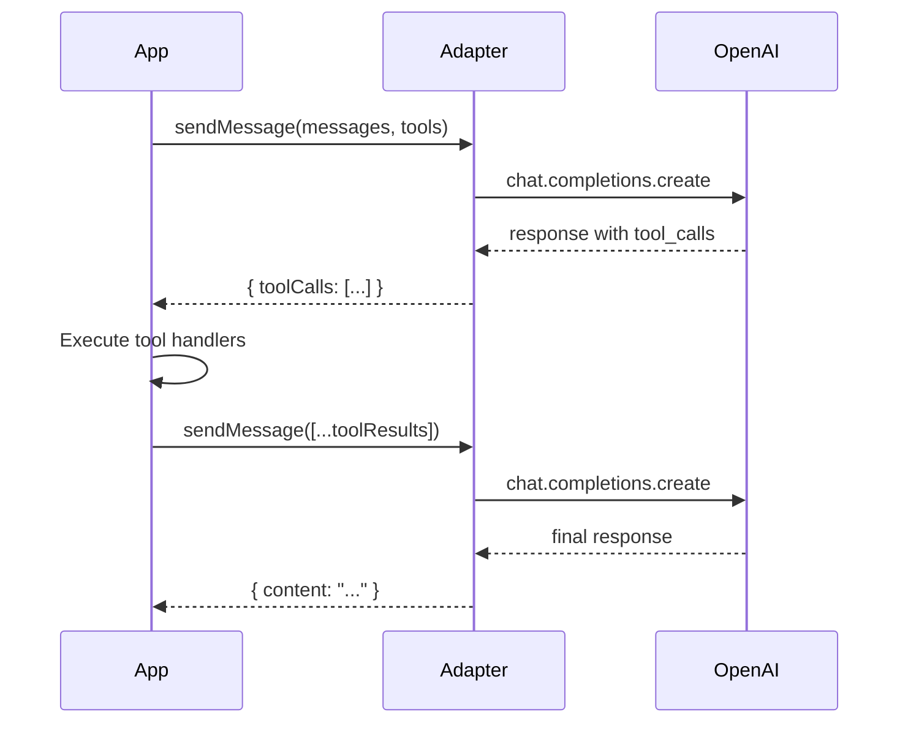

# LLM Integration

Squadventure uses OpenAI's GPT models with function calling (tool use) to power the AI Dungeon Master.

## Architecture Overview



## LLM Adapter Interface

The `LLMAdapter` interface abstracts LLM interactions:

```typescript
interface LLMAdapter {
  sendMessage(
    messages: LLMMessage[],
    tools?: LLMTool[],
    options?: LLMOptions
  ): Promise<LLMCompletionResponse>;
  
  streamMessage(
    messages: LLMMessage[],
    tools?: LLMTool[],
    options?: LLMOptions
  ): AsyncIterable<string>;
}
```

## OpenAI Adapter

The default implementation uses the OpenAI SDK:

```typescript
// infrastructure/src/llm/openai-adapter.ts
import OpenAI from 'openai';

export class OpenAIAdapter implements LLMAdapter {
  private client: OpenAI;
  private model: string;
  private temperature: number;
  
  constructor(config: OpenAIConfig) {
    this.client = new OpenAI({ apiKey: config.apiKey });
    this.model = config.model ?? 'gpt-4o-mini';
    this.temperature = config.temperature ?? 0.8;
  }
  
  async sendMessage(
    messages: LLMMessage[],
    tools?: LLMTool[]
  ): Promise<LLMCompletionResponse> {
    const response = await this.client.chat.completions.create({
      model: this.model,
      messages: this.formatMessages(messages),
      tools: tools ? this.formatTools(tools) : undefined,
      temperature: this.temperature,
    });
    
    return this.parseResponse(response);
  }
}
```

## Tool Calling

Tools are defined using JSON Schema:

```typescript
interface LLMTool {
  name: string;
  description: string;
  parameters: Record<string, unknown>;  // JSON Schema
}

// Example tool definition
const rollDiceTool: LLMTool = {
  name: 'roll_dice',
  description: 'Roll dice using standard notation',
  parameters: {
    type: 'object',
    properties: {
      notation: {
        type: 'string',
        description: 'Dice notation (e.g., "1d20+5")'
      },
      purpose: {
        type: 'string',
        description: 'What the roll is for'
      }
    },
    required: ['notation', 'purpose']
  }
};
```

### Tool Calling Flow



## Message Format

Messages follow the OpenAI chat format:

```typescript
interface LLMMessage {
  role: 'system' | 'user' | 'assistant' | 'tool';
  content: string;
  name?: string;          // For tool messages
  toolCallId?: string;    // For tool results
  toolCalls?: LLMToolCall[];  // For assistant tool requests
}
```

### System Prompt Structure

The system prompt provides context:

```typescript
function buildSystemPrompt(persona: DMPersona, context: GameContext): string {
  return `
You are ${persona.name}, an AI Dungeon Master.

${persona.systemPrompt}

## Current Scene
${context.sceneDescription}

## Player Character
${formatCharacterSheet(context.playerCharacter)}

## World Context
${context.worldSummary}

${context.combat ? formatCombatState(context.combat) : ''}

## Your Tools
You have access to game tools for dice rolls, combat, inventory, etc.
Always use tools rather than describing outcomes directly.
  `.trim();
}
```

## Streaming Responses

For long responses, streaming provides better UX:

```typescript
async *streamMessage(
  messages: LLMMessage[],
  tools?: LLMTool[]
): AsyncIterable<string> {
  const stream = await this.client.chat.completions.create({
    model: this.model,
    messages: this.formatMessages(messages),
    tools: tools ? this.formatTools(tools) : undefined,
    stream: true,
  });
  
  for await (const chunk of stream) {
    const content = chunk.choices[0]?.delta?.content;
    if (content) {
      yield content;
    }
  }
}
```

## Model Router (Future)

For cost optimization, different models can be used for different tasks:

```typescript
class ModelRouter {
  selectModel(taskType: TaskType): string {
    switch (taskType) {
      case 'combat':
        // Needs precision for rules
        return 'gpt-4o';
      case 'narrative':
        // Creative, can use cheaper model
        return 'gpt-4o-mini';
      case 'simple':
        // Basic responses
        return 'gpt-3.5-turbo';
    }
  }
}
```

## Error Handling

```typescript
async sendMessage(messages: LLMMessage[]): Promise<LLMCompletionResponse> {
  try {
    const response = await this.client.chat.completions.create({...});
    return this.parseResponse(response);
  } catch (error) {
    if (error instanceof OpenAI.APIError) {
      if (error.status === 429) {
        // Rate limited - implement retry
        await this.delay(1000);
        return this.sendMessage(messages);
      }
      if (error.status === 401) {
        throw new Error('Invalid API key');
      }
    }
    throw error;
  }
}
```

## Token Management

Track token usage for cost monitoring:

```typescript
interface LLMCompletionResponse {
  content: string | null;
  toolCalls?: LLMToolCallRequest[];
  finishReason: 'stop' | 'tool_calls' | 'length' | 'content_filter';
  usage: {
    promptTokens: number;
    completionTokens: number;
    totalTokens: number;
  };
}
```

## Configuration

```typescript
interface OpenAIConfig {
  apiKey: string;
  model?: string;           // Default: 'gpt-4o-mini'
  temperature?: number;     // Default: 0.8
  maxTokens?: number;       // Default: 2048
  timeout?: number;         // Default: 30000ms
}
```

## Best Practices

1. **Use System Prompts** - Establish consistent DM behavior
2. **Leverage Tools** - Let the AI call functions for game actions
3. **Handle Errors** - Graceful fallbacks for API issues
4. **Monitor Usage** - Track tokens for cost control
5. **Test Prompts** - Validate DM responses across scenarios

## Related Documentation

- [Overview](Overview.md) - System architecture
- [Data Flow](Data-Flow.md) - Message lifecycle
- [DM Tools Reference](../api-reference/DM-Tools.md) - Available tools
- [DM Personas](../core-systems/DM-Personas.md) - Persona configuration
