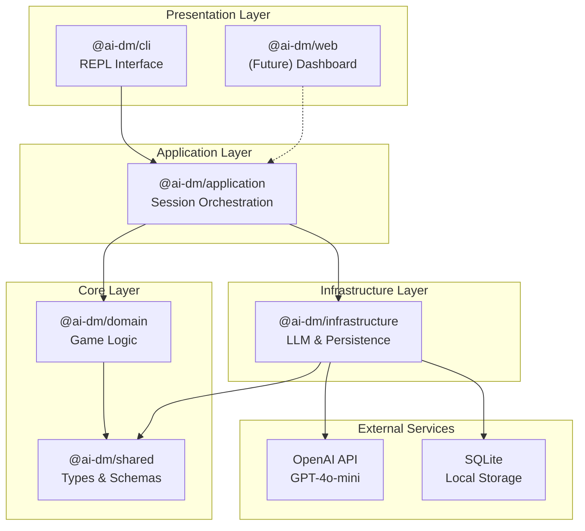
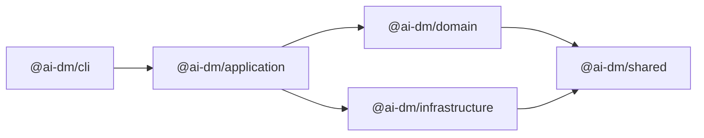
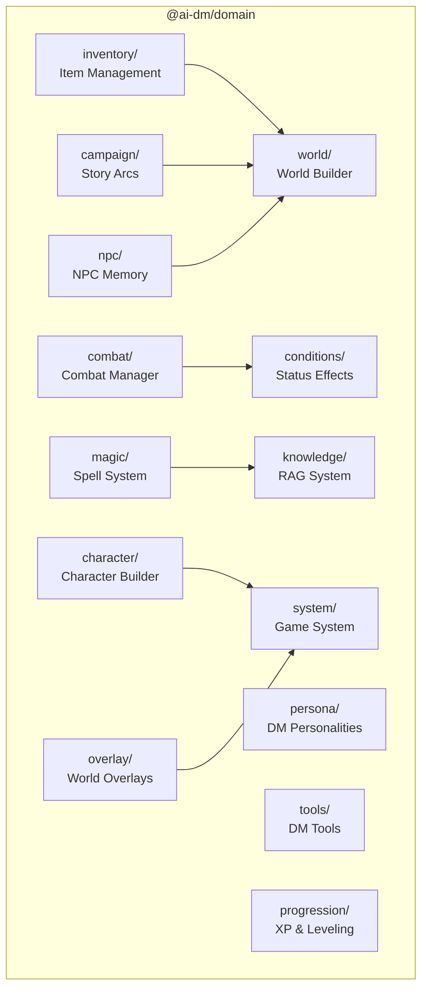
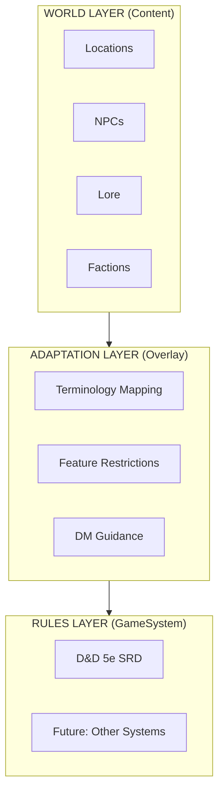

# Architecture Overview

Squadventure is built as a layered monorepo architecture with clear separation of concerns. This document provides a high-level view of the system design.

## System Architecture

## Layer Responsibilities

### Presentation Layer
- **CLI (`@ai-dm/cli`)**: Interactive REPL interface using Node.js readline
- **Web** (planned): React-based dashboard for game state visualization

### Application Layer
- **Session Orchestrator**: Coordinates game sessions, manages conversation flow
- **Snapshot Manager**: Handles save/load functionality

### Core Layer
- **Domain (`@ai-dm/domain`)**: All game logic, rules, and mechanics
- **Shared (`@ai-dm/shared`)**: TypeScript types, Zod schemas, branded IDs

### Infrastructure Layer
- **LLM Adapter**: OpenAI API integration with streaming and tool calling
- **Persistence**: SQLite for sessions, file-based snapshots

## Package Dependencies

## Domain Module Structure

## World Layer Architecture

The game world is organized in three layers:

## Extension Points

The architecture provides several extension points for future development:

1. **Game Systems**: Add new rule systems (Pathfinder, OSR) via the `GameSystem` interface
2. **World Overlays**: Create custom settings by defining terminology and restrictions
3. **DM Personas**: Define new AI personalities with custom prompts
4. **LLM Providers**: Swap OpenAI for other LLM providers
5. **Persistence Backends**: Add cloud storage or different databases

## Design Principles

### Dependency Inversion
Higher layers depend on abstractions defined in lower layers. Infrastructure implements interfaces, domain defines them.

### Single Responsibility
Each package and module has one clear purpose. Combat logic stays in combat, persistence in infrastructure.

### Immutable State
World state is treated as immutable. Changes create new snapshots rather than mutating existing state.

### Type Safety
Branded types (EntityId, LocationId) prevent mixing up IDs. Zod schemas validate runtime data.

## Related Documentation

- [Package Structure](Package-Structure.md) - Detailed package breakdown
- [Domain Model](Domain-Model.md) - Core entities
- [Data Flow](Data-Flow.md) - Message lifecycle
- [LLM Integration](LLM-Integration.md) - AI system details
