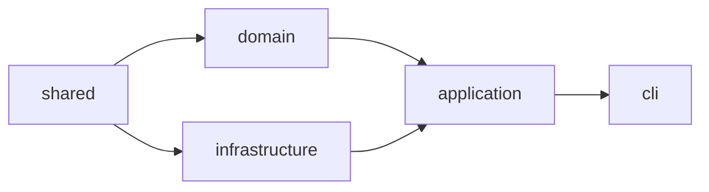

# Package Structure

Squadventure is organized as a pnpm monorepo with clear package boundaries.

## Directory Layout

```
squadventure/
├── packages/
│   ├── shared/          # @ai-dm/shared
│   ├── domain/          # @ai-dm/domain
│   ├── infrastructure/  # @ai-dm/infrastructure
│   ├── application/     # @ai-dm/application
│   ├── cli/             # @ai-dm/cli
│   └── web/             # @ai-dm/web (future)
├── data/
│   ├── systems/         # Game system configs
│   │   └── dnd5e/       # D&D 5e SRD data
│   └── overlays/        # World overlay configs
├── docs/
│   ├── wiki/            # This documentation
│   ├── api/             # TypeDoc output
│   └── Roadmap.md
├── package.json         # Root workspace config
├── pnpm-workspace.yaml  # Workspace definition
└── tsconfig.json        # Base TypeScript config
```

## Package Details

### @ai-dm/shared

**Purpose**: Type definitions and schemas shared across all packages.

```
packages/shared/
├── src/
│   ├── types.ts         # All TypeScript types
│   └── index.ts         # Barrel export
├── package.json
└── tsconfig.json
```

**Key Exports**:
- Branded ID types (EntityId, LocationId, SessionId, etc.)
- World model types (Location, Entity, NPCEntity)
- Character types (CharacterSheet, AbilityScores)
- Session types (GameSession, Turn, CombatState)
- Campaign types (Campaign, Chapter, Quest)
- Zod schemas for runtime validation

**Dependencies**: `zod`

### @ai-dm/domain

**Purpose**: All game logic, rules, and mechanics.

```
packages/domain/
├── src/
│   ├── campaign/        # Story arc management
│   ├── character/       # Character creation
│   ├── combat/          # Combat system
│   ├── conditions/      # Status effects
│   ├── inventory/       # Item management
│   ├── knowledge/       # RAG system
│   ├── magic/           # Spellcasting
│   ├── npc/             # NPC memory
│   ├── overlay/         # World overlays
│   ├── persona/         # DM personalities
│   ├── progression/     # XP & leveling
│   ├── system/          # GameSystem interface
│   ├── testing/         # AI player archetypes
│   ├── tools/           # DM tool definitions
│   └── world/           # World building
├── package.json
└── tsconfig.json
```

**Key Exports**:
- `GameSystem` interface and `Dnd5eGameSystem`
- Combat manager and tools
- Spell slot system
- Inventory manager
- Condition manager
- World overlay manager
- DM persona definitions

**Dependencies**: `@ai-dm/shared`

### @ai-dm/infrastructure

**Purpose**: External service integrations (LLM, storage).

```
packages/infrastructure/
├── src/
│   ├── config/          # Configuration loading
│   ├── llm/
│   │   ├── adapter.ts   # LLM interface
│   │   ├── openai-adapter.ts
│   │   └── model-router.ts
│   └── persistence/
│       ├── snapshot-store.ts
│       ├── session-store.ts
│       └── sqlite-store.ts
├── package.json
└── tsconfig.json
```

**Key Exports**:
- `LLMAdapter` interface
- `OpenAIAdapter` implementation
- `SnapshotStore` for file-based saves
- `SQLiteSessionStore` for database persistence

**Dependencies**: `@ai-dm/shared`, `openai`, `better-sqlite3`

### @ai-dm/application

**Purpose**: Session orchestration and workflow coordination.

```
packages/application/
├── src/
│   └── session/
│       ├── orchestrator.ts   # Main session controller
│       └── snapshot-manager.ts
├── package.json
└── tsconfig.json
```

**Key Exports**:
- `SessionOrchestrator` - coordinates game sessions
- `SnapshotManager` - handles save/load

**Dependencies**: `@ai-dm/shared`, `@ai-dm/domain`, `@ai-dm/infrastructure`

### @ai-dm/cli

**Purpose**: Interactive terminal interface.

```
packages/cli/
├── src/
│   ├── index.ts              # Entry point
│   ├── repl.ts               # REPL implementation
│   └── test-ai-players.ts    # AI player testing
├── package.json
└── tsconfig.json
```

**Key Exports**:
- `GameREPL` class
- CLI entry point

**Dependencies**: `@ai-dm/application`, `@ai-dm/infrastructure`, `chalk`, `readline`

## Data Directory

### Game Systems (`data/systems/`)

```
data/systems/dnd5e/
├── system.json       # System metadata
├── races.json        # SRD races
├── classes.json      # SRD classes
├── subclasses.json   # Subclass features
├── backgrounds.json  # SRD backgrounds
├── progression.json  # XP tables
└── spell-slots.json  # Slot progression
```

### World Overlays (`data/overlays/`)

```
data/overlays/
├── dark-fantasy.json   # Grimdark setting
└── sci-fi-reskin.json  # Space opera setting
```

## Build Order

Packages must be built in dependency order:



The `pnpm build` command handles this automatically.

## Adding a New Package

1. Create directory under `packages/`
2. Add `package.json` with proper name and dependencies
3. Add `tsconfig.json` extending root
4. Add to workspace if needed
5. Update build scripts

## Related Documentation

- [Overview](Overview.md) - High-level architecture
- [Building](../development/Building.md) - Build process details
