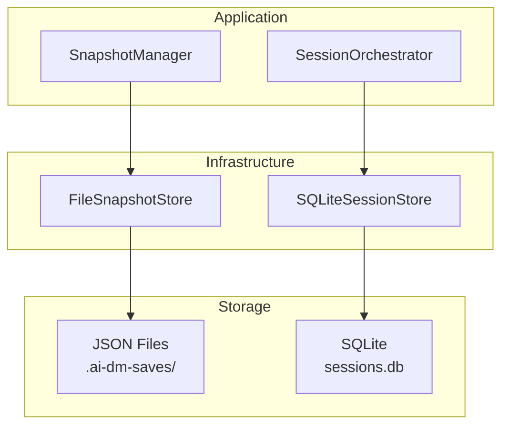

# Persistence

Squadventure uses a combination of SQLite and file-based storage for session persistence and game saves.

## Storage Architecture



## Snapshot System

Game snapshots capture complete game state for save/load functionality.

### GameSnapshot Structure

```typescript
interface GameSnapshot {
  id: SnapshotId;
  sessionId: SessionId;
  createdAt: Date;
  label?: string;
  worldState: WorldState;
  sessionState: Omit<GameSession, 'conversationHistory'>;
  contextCache: {
    narrativeSummary: string;
    recentMoments: string[];
    activeThreads: string[];
  };
  turnLog: Turn[];
  diceRolls: DiceRoll[];
}
```

### FileSnapshotStore

Saves snapshots as JSON files:

```typescript
// infrastructure/src/persistence/snapshot-store.ts
export class FileSnapshotStore {
  private savePath: string;
  
  constructor(savePath: string) {
    this.savePath = savePath;
    this.ensureDirectory();
  }
  
  async save(snapshot: GameSnapshot): Promise<void> {
    const filename = `${snapshot.id}.json`;
    const filepath = path.join(this.savePath, filename);
    await fs.writeFile(filepath, JSON.stringify(snapshot, null, 2));
  }
  
  async load(id: SnapshotId): Promise<GameSnapshot | null> {
    const filepath = path.join(this.savePath, `${id}.json`);
    try {
      const data = await fs.readFile(filepath, 'utf-8');
      return JSON.parse(data);
    } catch {
      return null;
    }
  }
  
  async list(): Promise<SnapshotInfo[]> {
    const files = await fs.readdir(this.savePath);
    // Parse and return snapshot metadata
  }
}
```

### Save File Format

```json
{
  "id": "snapshot-1701234567890",
  "sessionId": "session-abc123",
  "createdAt": "2024-11-27T12:00:00Z",
  "label": "Before boss fight",
  "worldState": {
    "id": "world-tavern",
    "name": "The Rusty Dragon Inn",
    "locations": { /* ... */ },
    "entities": { /* ... */ }
  },
  "sessionState": {
    "currentScene": { /* ... */ },
    "playerCharacters": [ /* ... */ ],
    "combat": null
  },
  "contextCache": {
    "narrativeSummary": "The party has just arrived at the tavern...",
    "recentMoments": ["Entered tavern", "Met bartender"],
    "activeThreads": ["Find the missing merchant"]
  },
  "turnLog": [ /* conversation history */ ],
  "diceRolls": [ /* all dice rolls */ ]
}
```

## SQLite Session Store

For active session persistence across restarts:

```typescript
// infrastructure/src/persistence/sqlite-store.ts
import Database from 'better-sqlite3';

export class SQLiteSessionStore {
  private db: Database.Database;
  
  constructor(dbPath: string) {
    this.db = new Database(dbPath);
    this.initSchema();
  }
  
  private initSchema(): void {
    this.db.exec(`
      CREATE TABLE IF NOT EXISTS sessions (
        id TEXT PRIMARY KEY,
        world_state_id TEXT NOT NULL,
        persona_id TEXT NOT NULL,
        created_at TEXT NOT NULL,
        updated_at TEXT NOT NULL,
        data TEXT NOT NULL
      );
      
      CREATE TABLE IF NOT EXISTS turns (
        id TEXT PRIMARY KEY,
        session_id TEXT NOT NULL,
        timestamp TEXT NOT NULL,
        role TEXT NOT NULL,
        content TEXT NOT NULL,
        metadata TEXT,
        FOREIGN KEY (session_id) REFERENCES sessions(id)
      );
      
      CREATE INDEX IF NOT EXISTS idx_turns_session 
        ON turns(session_id);
    `);
  }
  
  saveSession(session: GameSession): void {
    const stmt = this.db.prepare(`
      INSERT OR REPLACE INTO sessions 
      (id, world_state_id, persona_id, created_at, updated_at, data)
      VALUES (?, ?, ?, ?, ?, ?)
    `);
    
    stmt.run(
      session.id,
      session.worldStateId,
      session.personaId,
      session.createdAt.toISOString(),
      session.updatedAt.toISOString(),
      JSON.stringify(session)
    );
  }
  
  loadSession(id: SessionId): GameSession | null {
    const row = this.db.prepare(
      'SELECT data FROM sessions WHERE id = ?'
    ).get(id);
    
    return row ? JSON.parse(row.data) : null;
  }
}
```

## SnapshotManager

Coordinates save/load operations:

```typescript
// application/src/session/snapshot-manager.ts
export class SnapshotManager {
  constructor(private store: SnapshotStore) {}
  
  async createSnapshot(
    session: GameSession,
    worldState: WorldState,
    options?: { label?: string }
  ): Promise<GameSnapshot> {
    const snapshot: GameSnapshot = {
      id: createSnapshotId(`snapshot-${Date.now()}`),
      sessionId: session.id,
      createdAt: new Date(),
      label: options?.label,
      worldState: this.serializeWorldState(worldState),
      sessionState: this.extractSessionState(session),
      contextCache: this.buildContextCache(session),
      turnLog: session.conversationHistory,
      diceRolls: this.extractDiceRolls(session),
    };
    
    await this.store.save(snapshot);
    return snapshot;
  }
  
  async loadSnapshot(id: SnapshotId): Promise<GameSnapshot | null> {
    return this.store.load(id);
  }
  
  async listSnapshots(): Promise<SnapshotInfo[]> {
    return this.store.list();
  }
}
```

## REPL Commands

Save and load commands in the CLI:

```typescript
// Save current game
private async handleSave(label?: string): Promise<void> {
  const session = this.orchestrator.getSession();
  const snapshot = await this.snapshotManager.createSnapshot(
    session,
    this.worldState,
    label ? { label } : undefined
  );
  console.log(`✓ Game saved: ${snapshot.id}`);
}

// Load saved game
private async handleLoad(args: string[]): Promise<void> {
  const snapshots = await this.snapshotManager.listSnapshots();
  
  // Show list or load specific save
  const snapshot = await this.snapshotManager.loadSnapshot(snapInfo.id);
  
  // Restore session state
  this.orchestrator.restoreFromSnapshot({
    worldState: snapshot.worldState,
    sessionState: snapshot.sessionState,
    turnLog: snapshot.turnLog,
  });
}
```

## Data Migration

For schema changes, versioned migrations are used:

```typescript
interface Migration {
  version: number;
  up(db: Database.Database): void;
  down(db: Database.Database): void;
}

const migrations: Migration[] = [
  {
    version: 1,
    up(db) {
      db.exec(`
        ALTER TABLE sessions 
        ADD COLUMN campaign_id TEXT;
      `);
    },
    down(db) {
      // SQLite doesn't support DROP COLUMN easily
    }
  }
];
```

## Storage Locations

| Data Type | Location | Format |
|-----------|----------|--------|
| Game saves | `.ai-dm-saves/` | JSON files |
| Active sessions | `.ai-dm/sessions.db` | SQLite |
| Game system data | `data/systems/` | JSON files |
| World overlays | `data/overlays/` | JSON files |

## Best Practices

1. **Atomic Writes** - Use temp files and rename for safety
2. **Versioning** - Include schema version in saved data
3. **Compression** - Consider gzip for large saves (future)
4. **Cleanup** - Implement auto-delete for old auto-saves

## Related Documentation

- [Overview](Overview.md) - System architecture
- [Configuration](../getting-started/Configuration.md) - Storage paths
- [Commands Reference](../reference/Commands.md) - Save/load commands
