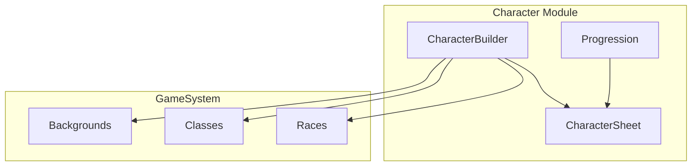

# Character System

The character system handles character creation, progression, and management.

## Architecture



## CharacterSheet Structure

```typescript
interface CharacterSheet {
  id: EntityId;
  name: string;
  race: string;
  class: string;
  level: number;
  experience: CharacterExperience;
  background: string;
  stats: CreatureStats;
  inventory: CharacterInventory;
  spellcasting?: CharacterSpellcasting;
  hitDice: HitDice;
  deathSaves?: DeathSaves;
  features: string[];
  proficiencies: {
    armor: string[];
    weapons: string[];
    tools: string[];
    languages: string[];
  };
}
```

## Character Builder

```typescript
// domain/src/character/character-builder.ts
class CharacterBuilder {
  private character: Partial<CharacterSheet>;
  private system: GameSystem;
  
  constructor(system: GameSystem) {
    this.system = system;
    this.character = {};
  }
  
  setName(name: string): this {
    this.character.name = name;
    return this;
  }
  
  setRace(raceKey: string): this {
    const race = this.system.getRace(raceKey);
    if (!race) throw new Error(`Unknown race: ${raceKey}`);
    this.character.race = raceKey;
    // Apply racial traits
    return this;
  }
  
  setClass(classKey: string): this {
    const cls = this.system.getClass(classKey);
    if (!cls) throw new Error(`Unknown class: ${classKey}`);
    this.character.class = classKey;
    // Set hit die, proficiencies, etc.
    return this;
  }
  
  setBackground(backgroundKey: string): this {
    const bg = this.system.getBackground(backgroundKey);
    if (!bg) throw new Error(`Unknown background: ${backgroundKey}`);
    this.character.background = backgroundKey;
    // Apply background proficiencies
    return this;
  }
  
  setAbilityScores(scores: AbilityScores): this {
    this.character.stats = {
      abilityScores: scores,
      armorClass: 10 + this.system.calculateAbilityModifier(scores.dexterity),
      hitPoints: { current: 0, max: 0 },
      speed: 30,
    };
    return this;
  }
  
  build(): CharacterSheet {
    // Validate all required fields
    // Calculate derived stats
    // Return complete character
  }
}
```

### Usage Example

```typescript
import { CharacterBuilder, getDnd5eSystem } from '@ai-dm/domain';

const system = getDnd5eSystem();
const builder = new CharacterBuilder(system);

const wizard = builder
  .setName('Elara Starweaver')
  .setRace('elf')
  .setClass('wizard')
  .setBackground('sage')
  .setAbilityScores({
    strength: 8,
    dexterity: 14,
    constitution: 12,
    intelligence: 16,
    wisdom: 13,
    charisma: 10,
  })
  .build();

console.log(wizard);
// {
//   name: 'Elara Starweaver',
//   race: 'elf',
//   class: 'wizard',
//   level: 1,
//   stats: {
//     abilityScores: { strength: 8, dexterity: 16, ... },  // +2 DEX from elf
//     armorClass: 13,  // 10 + 3 DEX mod
//     hitPoints: { current: 8, max: 8 },  // d6 + 2 CON mod
//   },
//   features: ['Darkvision', 'Fey Ancestry', 'Trance', 'Spellcasting', 'Arcane Recovery'],
//   ...
// }
```

## Ability Scores

### Standard Array

```typescript
const standardArray = [15, 14, 13, 12, 10, 8];
```

### Point Buy (Future)

```typescript
interface PointBuyConfig {
  points: number;  // 27 by default
  min: number;     // 8
  max: number;     // 15
  costs: Record<number, number>;  // 8: 0, 9: 1, 10: 2, etc.
}
```

### Ability Modifiers

```typescript
function calculateModifier(score: number): number {
  return Math.floor((score - 10) / 2);
}

// 1 → -5
// 10 → 0
// 14 → +2
// 18 → +4
// 20 → +5
```

## Racial Traits

Applied during character creation:

```typescript
function applyRacialTraits(character: CharacterSheet, race: RaceDefinition): void {
  // Ability bonuses
  for (const [ability, bonus] of Object.entries(race.abilityBonuses)) {
    character.stats.abilityScores[ability] += bonus;
  }
  
  // Size and speed
  character.stats.speed = race.speed;
  
  // Traits
  character.features.push(...race.traits);
  
  // Languages
  character.proficiencies.languages.push(...race.languages);
}
```

## Class Features

Features are gained at specific levels:

```typescript
interface ClassFeature {
  level: number;
  name: string;
  description: string;
}

function getClassFeaturesAtLevel(
  classKey: string,
  level: number,
  system: GameSystem
): ClassFeature[] {
  const cls = system.getClass(classKey);
  return cls?.features.filter(f => f.level <= level) ?? [];
}
```

## Progression

### Experience and Leveling

```typescript
interface CharacterExperience {
  current: number;
  nextLevelAt: number;
}

function awardXP(character: CharacterSheet, xp: number, system: GameSystem): void {
  character.experience.current += xp;
  
  // Check for level up
  while (character.experience.current >= character.experience.nextLevelAt && 
         character.level < 20) {
    levelUp(character, system);
  }
}

function levelUp(character: CharacterSheet, system: GameSystem): void {
  character.level += 1;
  character.experience.nextLevelAt = system.progression.getXPThreshold(character.level + 1);
  
  // Increase HP
  const cls = system.getClass(character.class);
  const conMod = system.calculateAbilityModifier(character.stats.abilityScores.constitution);
  const hpGain = Math.max(1, Math.floor(cls!.hitDie / 2) + 1 + conMod);
  character.stats.hitPoints.max += hpGain;
  character.stats.hitPoints.current += hpGain;
  
  // Add new features
  const newFeatures = cls!.features.filter(f => f.level === character.level);
  character.features.push(...newFeatures.map(f => f.name));
  
  // Update spell slots for casters
  if (character.spellcasting) {
    updateSpellSlots(character, system);
  }
}
```

### Hit Dice

```typescript
interface HitDice {
  current: number;  // Available to spend
  max: number;      // Equals character level
  dieType: 6 | 8 | 10 | 12;  // Based on class
}

// Short rest: spend hit dice to heal
function spendHitDie(character: CharacterSheet): number {
  if (character.hitDice.current <= 0) return 0;
  
  character.hitDice.current -= 1;
  const roll = Math.floor(Math.random() * character.hitDice.dieType) + 1;
  const conMod = Math.floor((character.stats.abilityScores.constitution - 10) / 2);
  const healing = Math.max(1, roll + conMod);
  
  character.stats.hitPoints.current = Math.min(
    character.stats.hitPoints.current + healing,
    character.stats.hitPoints.max
  );
  
  return healing;
}

// Long rest: recover half hit dice
function longRest(character: CharacterSheet): void {
  // Recover HP
  character.stats.hitPoints.current = character.stats.hitPoints.max;
  
  // Recover hit dice (half level, minimum 1)
  const recover = Math.max(1, Math.floor(character.level / 2));
  character.hitDice.current = Math.min(
    character.hitDice.current + recover,
    character.hitDice.max
  );
  
  // Recover spell slots
  if (character.spellcasting) {
    resetSpellSlots(character);
  }
}
```

## Proficiencies

```typescript
interface Proficiencies {
  armor: string[];
  weapons: string[];
  tools: string[];
  languages: string[];
}

function isProficient(character: CharacterSheet, item: string): boolean {
  const all = [
    ...character.proficiencies.armor,
    ...character.proficiencies.weapons,
    ...character.proficiencies.tools,
  ];
  return all.some(p => item.toLowerCase().includes(p.toLowerCase()));
}

function getProficiencyBonus(character: CharacterSheet, system: GameSystem): number {
  return system.progression.getProficiencyBonus(character.level);
}
```

## Related Documentation

- [Game System Abstraction](Game-System-Abstraction.md) - System interface
- [D&D 5e Implementation](DnD-5e-Implementation.md) - Available options
- [Magic System](Magic-System.md) - Spellcasting for casters
- [Inventory System](Inventory-System.md) - Equipment management
