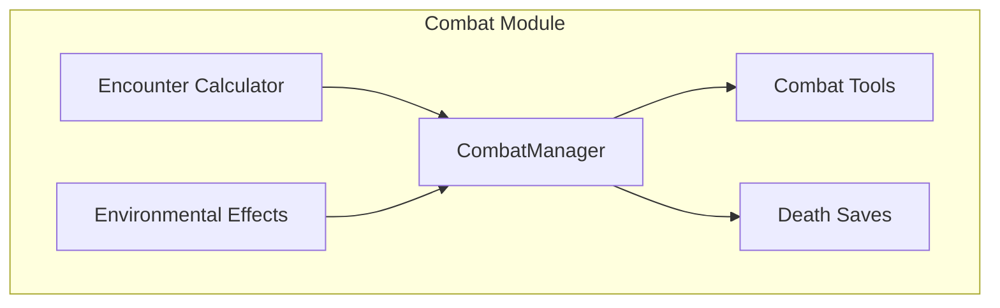
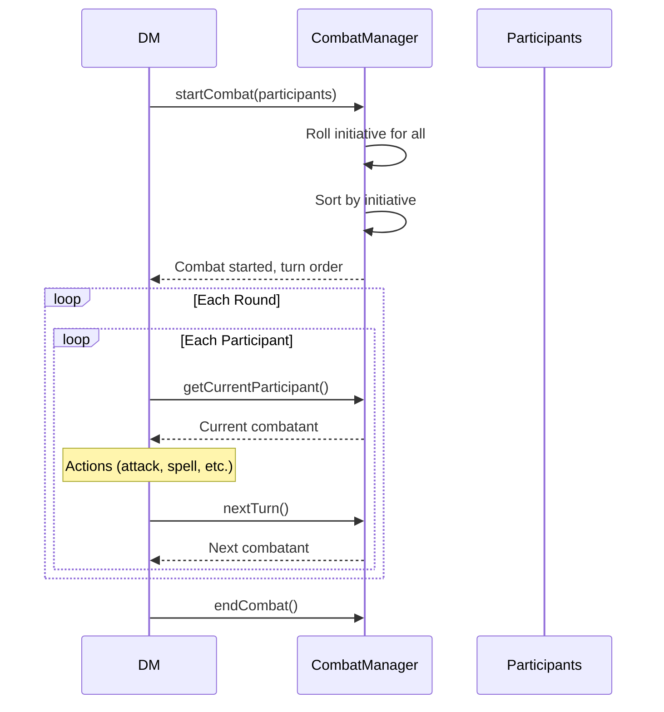

# Combat System

The combat system handles initiative, turns, attacks, conditions, and all combat-related mechanics.

## Architecture



## CombatManager

The central combat controller:

```typescript
// domain/src/combat/combat-manager.ts
class CombatManager {
  private state: CombatState | null = null;
  private participants: Map<EntityId, ParticipantState>;
  
  startCombat(participants: CombatParticipant[]): CombatState;
  endCombat(): void;
  nextTurn(): CombatParticipant | null;
  
  makeAttack(attacker: EntityId, target: EntityId, ...): AttackResult;
  makeSavingThrow(entity: EntityId, ability: string, dc: number): SavingThrowResult;
  
  applyDamage(entity: EntityId, damage: number): string;
  applyHealing(entity: EntityId, healing: number): string;
  applyCondition(entity: EntityId, condition: Condition): string;
  removeCondition(entity: EntityId, condition: Condition): string;
  
  getState(): CombatState | null;
  getSummary(): string;
}
```

## Combat Flow



## Initiative

Initiative is rolled automatically when combat starts:

```typescript
interface CombatParticipant {
  entityId: EntityId;
  name: string;
  isPlayer: boolean;
  stats: {
    abilityScores: AbilityScores;
    armorClass: number;
    hitPoints: { current: number; max: number };
    speed: number;
  };
}

// Roll initiative: d20 + DEX modifier
function rollInitiative(participant: CombatParticipant): number {
  const dexMod = Math.floor((participant.stats.abilityScores.dexterity - 10) / 2);
  const roll = Math.floor(Math.random() * 20) + 1;
  return roll + dexMod;
}
```

## Attack Resolution

```typescript
interface AttackResult {
  attackRoll: number;
  modifier: number;
  total: number;
  targetAC: number;
  hit: boolean;
  critical: boolean;
  damage?: number;
  damageType?: string;
  message: string;
}

function makeAttack(
  attackerId: EntityId,
  targetId: EntityId,
  attackBonus: number,
  damageNotation: string,
  damageType: string,
  options?: { advantage?: boolean; disadvantage?: boolean }
): AttackResult {
  // Roll d20
  let attackRoll: number;
  if (options?.advantage) {
    attackRoll = Math.max(rollD20(), rollD20());
  } else if (options?.disadvantage) {
    attackRoll = Math.min(rollD20(), rollD20());
  } else {
    attackRoll = rollD20();
  }
  
  const total = attackRoll + attackBonus;
  const critical = attackRoll === 20;
  const hit = critical || total >= targetAC;
  
  if (hit) {
    // Roll damage (double dice on crit)
    const damage = rollDamage(damageNotation, critical);
    // Apply damage to target
    this.applyDamage(targetId, damage);
  }
  
  return { attackRoll, modifier: attackBonus, total, targetAC, hit, critical, damage, damageType };
}
```

## Conditions

D&D 5e conditions that affect combat:

| Condition | Effect |
|-----------|--------|
| Blinded | Disadvantage on attacks, enemies have advantage |
| Charmed | Can't attack charmer |
| Deafened | Can't hear |
| Frightened | Disadvantage when source visible |
| Grappled | Speed 0 |
| Incapacitated | No actions or reactions |
| Invisible | Advantage on attacks, attacks against have disadvantage |
| Paralyzed | Incapacitated, auto-fail STR/DEX saves |
| Petrified | Turned to stone |
| Poisoned | Disadvantage on attacks and ability checks |
| Prone | Disadvantage on attacks, melee attacks have advantage |
| Restrained | Speed 0, disadvantage on attacks |
| Stunned | Incapacitated, auto-fail STR/DEX saves |
| Unconscious | Incapacitated, drops items, prone |

```typescript
type Condition = 
  | 'blinded' | 'charmed' | 'deafened' | 'frightened'
  | 'grappled' | 'incapacitated' | 'invisible' | 'paralyzed'
  | 'petrified' | 'poisoned' | 'prone' | 'restrained'
  | 'stunned' | 'unconscious' | 'concentrating';
```

## Death Saves

When a character drops to 0 HP:

```typescript
interface DeathSaves {
  successes: number;  // 0-3
  failures: number;   // 0-3
  stable: boolean;
}

function makeDeathSave(character: CharacterSheet): DeathSaveResult {
  const roll = rollD20();
  
  if (roll === 1) {
    // Critical fail: 2 failures
    character.deathSaves!.failures += 2;
  } else if (roll === 20) {
    // Critical success: regain 1 HP, conscious
    character.stats.hitPoints.current = 1;
    resetDeathSaves(character);
    return { roll, stable: true, conscious: true };
  } else if (roll >= 10) {
    character.deathSaves!.successes += 1;
  } else {
    character.deathSaves!.failures += 1;
  }
  
  // Check for stabilization or death
  if (character.deathSaves!.successes >= 3) {
    character.deathSaves!.stable = true;
    return { roll, stable: true, conscious: false };
  }
  if (character.deathSaves!.failures >= 3) {
    return { roll, stable: false, dead: true };
  }
  
  return { roll, stable: false };
}
```

## Encounter Calculator

DMG-accurate difficulty calculation:

```typescript
interface EncounterDifficulty {
  rating: 'Easy' | 'Medium' | 'Hard' | 'Deadly';
  partyThreshold: number;
  adjustedXP: number;
  actualXP: number;
}

function calculateDifficulty(
  partyLevels: number[],
  monsterCRs: (string | number)[]
): EncounterDifficulty {
  // Sum party XP thresholds
  const thresholds = partyLevels.map(level => getXPThresholds(level));
  
  // Sum monster XP with multiplier for groups
  const monsterXP = monsterCRs.reduce((sum, cr) => sum + getXPForCR(cr), 0);
  const multiplier = getEncounterMultiplier(monsterCRs.length);
  const adjustedXP = monsterXP * multiplier;
  
  // Determine difficulty rating
  // ...
}
```

## Environmental Effects

Terrain and hazards:

```typescript
interface EnvironmentalEffect {
  type: 'terrain' | 'hazard' | 'weather';
  name: string;
  description: string;
  effects: {
    movementCost?: number;
    savingThrow?: { ability: string; dc: number };
    damage?: { dice: string; type: string };
    condition?: string;
  };
}

// Example: Difficult Terrain
const difficultTerrain: EnvironmentalEffect = {
  type: 'terrain',
  name: 'Difficult Terrain',
  description: 'Dense undergrowth, rubble, or other obstacles',
  effects: {
    movementCost: 2  // Costs 2 feet per foot of movement
  }
};
```

## Combat Tools

DM tools for combat actions:

- `start_combat` - Initialize encounter
- `end_combat` - End encounter
- `next_turn` - Advance initiative
- `attack_roll` - Make attacks
- `saving_throw` - Make saves
- `apply_condition` - Add status effects
- `remove_condition` - Remove effects
- `apply_damage` - Deal damage
- `apply_healing` - Restore HP
- `combat_status` - Get summary

See [DM Tools Reference](../api-reference/DM-Tools.md) for full documentation.

## Related Documentation

- [Game System Abstraction](Game-System-Abstraction.md) - Combat subsystem
- [Conditions Manager](Conditions-Manager.md) - Detailed condition handling
- [DM Tools Reference](../api-reference/DM-Tools.md) - Tool documentation
