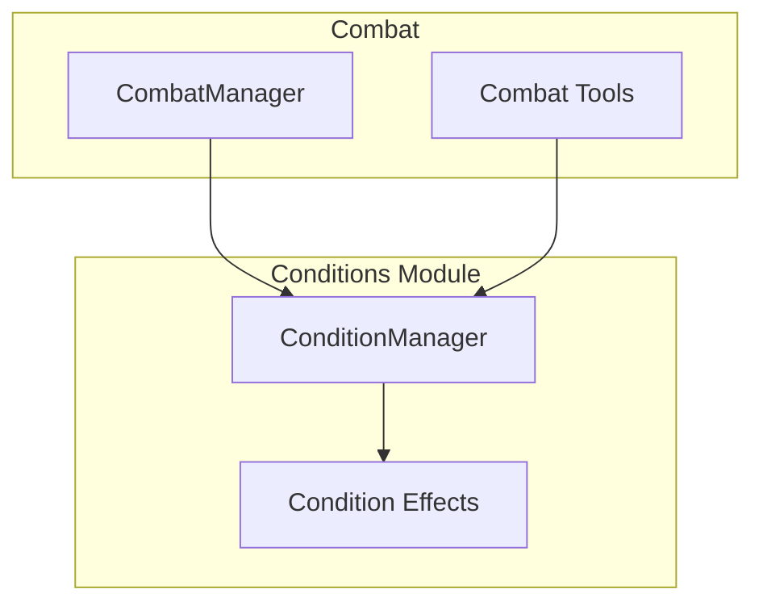

# Conditions Manager

The conditions manager tracks and applies status effects on creatures during gameplay.

## Architecture



## ConditionManager

```typescript
// domain/src/conditions/condition-manager.ts

type ConditionType = 
  | 'blinded' | 'charmed' | 'deafened' | 'exhaustion'
  | 'frightened' | 'grappled' | 'incapacitated' | 'invisible'
  | 'paralyzed' | 'petrified' | 'poisoned' | 'prone'
  | 'restrained' | 'stunned' | 'unconscious' | 'concentrating';

type DurationType = 'rounds' | 'minutes' | 'until_removed' | 'end_of_turn';

interface ConditionInstance {
  type: ConditionType;
  sourceId?: EntityId;
  duration: DurationType;
  remainingRounds?: number;
  saveDC?: number;
  saveAbility?: keyof AbilityScores;
}

interface ConditionCheckResult {
  hasAdvantage: boolean;
  hasDisadvantage: boolean;
  autoFail: boolean;
  autoSuccess: boolean;
  cantAct: boolean;
  speedZero: boolean;
}

class ConditionManager {
  private conditions: Map<EntityId, ConditionInstance[]>;
  
  applyCondition(
    entityId: EntityId,
    condition: ConditionType,
    options?: {
      sourceId?: EntityId;
      duration?: DurationType;
      rounds?: number;
      saveDC?: number;
      saveAbility?: keyof AbilityScores;
    }
  ): string {
    const instance: ConditionInstance = {
      type: condition,
      sourceId: options?.sourceId,
      duration: options?.duration ?? 'until_removed',
      remainingRounds: options?.rounds,
      saveDC: options?.saveDC,
      saveAbility: options?.saveAbility,
    };
    
    const existing = this.conditions.get(entityId) ?? [];
    existing.push(instance);
    this.conditions.set(entityId, existing);
    
    return this.formatConditionApplied(condition);
  }
  
  removeCondition(entityId: EntityId, condition: ConditionType): string {
    const conditions = this.conditions.get(entityId) ?? [];
    const index = conditions.findIndex(c => c.type === condition);
    
    if (index === -1) {
      return `${condition} condition not found.`;
    }
    
    conditions.splice(index, 1);
    return `${condition} condition removed.`;
  }
  
  getConditions(entityId: EntityId): ConditionType[] {
    return (this.conditions.get(entityId) ?? []).map(c => c.type);
  }
  
  checkConditionEffects(
    entityId: EntityId,
    checkType: 'attack' | 'defense' | 'ability' | 'save'
  ): ConditionCheckResult {
    const conditions = this.getConditions(entityId);
    
    const result: ConditionCheckResult = {
      hasAdvantage: false,
      hasDisadvantage: false,
      autoFail: false,
      autoSuccess: false,
      cantAct: false,
      speedZero: false,
    };
    
    for (const condition of conditions) {
      const effects = CONDITION_EFFECTS[condition];
      this.applyEffects(result, effects, checkType);
    }
    
    return result;
  }
  
  processEndOfTurn(entityId: EntityId): string[] {
    const messages: string[] = [];
    const conditions = this.conditions.get(entityId) ?? [];
    
    for (let i = conditions.length - 1; i >= 0; i--) {
      const instance = conditions[i]!;
      
      if (instance.duration === 'end_of_turn') {
        conditions.splice(i, 1);
        messages.push(`${instance.type} condition ended.`);
      } else if (instance.duration === 'rounds' && instance.remainingRounds !== undefined) {
        instance.remainingRounds -= 1;
        if (instance.remainingRounds <= 0) {
          conditions.splice(i, 1);
          messages.push(`${instance.type} condition ended.`);
        }
      }
    }
    
    return messages;
  }
}
```

## Condition Effects

Each condition has defined mechanical effects:

```typescript
const CONDITION_EFFECTS: Record<ConditionType, ConditionEffect> = {
  blinded: {
    description: "Can't see, auto-fail sight checks",
    attackRolls: { disadvantage: true },
    attacksAgainst: { advantage: true },
    abilityChecks: { autoFail: ['sight'] },
  },
  
  charmed: {
    description: "Can't attack charmer",
    restrictions: ['no_attack_source'],
    socialChecks: { disadvantage: true, against: 'charmer' },
  },
  
  frightened: {
    description: "Disadvantage while source visible, can't approach",
    attackRolls: { disadvantage: true, condition: 'source_visible' },
    abilityChecks: { disadvantage: true, condition: 'source_visible' },
    movement: { cantApproachSource: true },
  },
  
  grappled: {
    description: 'Speed 0',
    movement: { speedZero: true },
  },
  
  incapacitated: {
    description: "Can't take actions or reactions",
    actions: { none: true },
    reactions: { none: true },
  },
  
  invisible: {
    description: 'Heavily obscured for hiding',
    attackRolls: { advantage: true },
    attacksAgainst: { disadvantage: true },
  },
  
  paralyzed: {
    description: 'Incapacitated, auto-fail STR/DEX, crits in 5ft',
    inherits: ['incapacitated'],
    savingThrows: { autoFail: ['strength', 'dexterity'] },
    attacksAgainst: { advantage: true, critWithin5ft: true },
  },
  
  petrified: {
    description: 'Turned to stone',
    inherits: ['incapacitated'],
    resistances: ['all'],
    immunities: ['poison', 'disease'],
    savingThrows: { autoFail: ['strength', 'dexterity'] },
  },
  
  poisoned: {
    description: 'Disadvantage on attacks and ability checks',
    attackRolls: { disadvantage: true },
    abilityChecks: { disadvantage: true },
  },
  
  prone: {
    description: 'Disadvantage on attacks, melee has advantage',
    attackRolls: { disadvantage: true },
    attacksAgainst: { advantage: true, condition: 'melee' },
    movement: { crawl: true },
  },
  
  restrained: {
    description: 'Speed 0, disadvantage on attacks/DEX saves',
    movement: { speedZero: true },
    attackRolls: { disadvantage: true },
    attacksAgainst: { advantage: true },
    savingThrows: { disadvantage: ['dexterity'] },
  },
  
  stunned: {
    description: 'Incapacitated, auto-fail STR/DEX',
    inherits: ['incapacitated'],
    savingThrows: { autoFail: ['strength', 'dexterity'] },
    attacksAgainst: { advantage: true },
  },
  
  unconscious: {
    description: 'Incapacitated, prone, drop items',
    inherits: ['incapacitated', 'prone'],
    dropItems: true,
    unaware: true,
    attacksAgainst: { critWithin5ft: true },
  },
  
  exhaustion: {
    description: 'Cumulative exhaustion levels',
    levels: {
      1: { abilityChecks: { disadvantage: true } },
      2: { movement: { halved: true } },
      3: { attackRolls: { disadvantage: true }, savingThrows: { disadvantage: true } },
      4: { hitPoints: { maxHalved: true } },
      5: { movement: { speedZero: true } },
      6: { death: true },
    },
  },
  
  concentrating: {
    description: 'Concentrating on a spell',
    interruptible: true,
    saveDC: 10,  // Or half damage, whichever is higher
  },
};
```

## Usage in Combat

```typescript
// Apply condition from spell
function handleHoldPerson(target: EntityId, spellDC: number): void {
  conditionManager.applyCondition(target, 'paralyzed', {
    duration: 'rounds',
    rounds: 10,  // 1 minute = 10 rounds
    saveDC: spellDC,
    saveAbility: 'wisdom',
  });
}

// Check effects when attacking
function getAttackModifiers(attacker: EntityId): AttackModifiers {
  const check = conditionManager.checkConditionEffects(attacker, 'attack');
  
  return {
    advantage: check.hasAdvantage,
    disadvantage: check.hasDisadvantage,
    canAct: !check.cantAct,
  };
}

// End of turn processing
function processEndOfTurn(entityId: EntityId): void {
  const messages = conditionManager.processEndOfTurn(entityId);
  for (const msg of messages) {
    console.log(msg);
  }
}
```

## Condition Tools

### apply_condition

```typescript
const applyConditionTool = {
  name: 'apply_condition',
  description: 'Apply a condition to a combatant.',
  parameters: {
    type: 'object',
    properties: {
      entityId: { type: 'string' },
      condition: {
        type: 'string',
        enum: [
          'blinded', 'charmed', 'deafened', 'frightened', 'grappled',
          'incapacitated', 'invisible', 'paralyzed', 'petrified', 'poisoned',
          'prone', 'restrained', 'stunned', 'unconscious', 'concentrating',
        ],
      },
    },
    required: ['entityId', 'condition'],
  },
};
```

### remove_condition

```typescript
const removeConditionTool = {
  name: 'remove_condition',
  description: 'Remove a condition from a combatant.',
  parameters: {
    type: 'object',
    properties: {
      entityId: { type: 'string' },
      condition: { type: 'string' },
    },
    required: ['entityId', 'condition'],
  },
};
```

## Related Documentation

- [Combat System](Combat-System.md) - Conditions in combat
- [Knowledge Base](Knowledge-Base.md) - Condition lookup
- [DM Tools Reference](../api-reference/DM-Tools.md) - Condition tools
