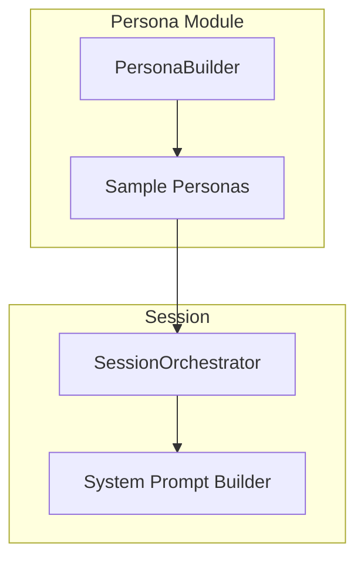

# DM Personas

The persona system defines different AI Dungeon Master personalities that affect narration style, humor, and ruling philosophy.

## Architecture



## DMPersona Structure

```typescript
// shared/src/types.ts

interface DMPersona {
  id: PersonaId;
  name: string;
  voice: VoiceProfile;
  rulingPhilosophy: RulingPhilosophy;
  improv: ImprovStyle;
  systemPrompt: string;
  exampleExchanges: ConversationExample[];
  catchphrases: string[];
}
```

### Voice Profile

Controls narration style:

```typescript
interface VoiceProfile {
  /** Response length preference */
  verbosity: 'terse' | 'moderate' | 'verbose';
  /** Language formality */
  formality: 'casual' | 'moderate' | 'formal';
  /** Humor configuration */
  humor: HumorProfile;
}

interface HumorProfile {
  /** How often to inject humor (0-1) */
  frequency: number;
  /** Types of humor to use */
  types: HumorType[];
  /** Break fourth wall occasionally */
  fourthWallBreaks: boolean;
  /** Self-deprecating jokes */
  selfDeprecation: boolean;
}

type HumorType = 
  | 'absurdist'    // Monty Python style
  | 'dry'          // Deadpan delivery
  | 'slapstick'    // Physical comedy
  | 'referential'  // Pop culture references
  | 'wordplay';    // Puns and wit
```

### Ruling Philosophy

How the DM handles rules and player actions:

```typescript
interface RulingPhilosophy {
  /** How strictly to follow RAW (0 = loose, 1 = strict) */
  ruleAdherence: number;
  /** Favor player wishes vs reality (0 = reality, 1 = player) */
  playerAgencyBias: number;
  /** How harsh consequences are (0 = gentle, 1 = brutal) */
  consequenceSeverity: number;
}
```

### Improv Style

How the DM handles unexpected situations:

```typescript
interface ImprovStyle {
  /** How likely to "yes, and" player ideas (0-1) */
  yesAndTendency: number;
  /** Memory for callbacks and running jokes */
  callbackMemory: 'poor' | 'good' | 'excellent';
}
```

### Example Exchanges

Few-shot examples for the LLM:

```typescript
interface ConversationExample {
  playerInput: string;
  dmResponse: string;
  context?: string;  // Optional scene setup
}
```

## Built-in Personas

### Spencer (Default)

Inspired by Spencer Crittenden from Harmontown—improvisational, comedic, player-focused.

```typescript
const spencerPersona: DMPersona = {
  id: createPersonaId('spencer'),
  name: 'Spencer',
  voice: {
    verbosity: 'moderate',
    formality: 'casual',
    humor: {
      frequency: 0.6,
      types: ['absurdist', 'referential', 'dry'],
      fourthWallBreaks: true,
      selfDeprecation: true,
    },
  },
  rulingPhilosophy: {
    ruleAdherence: 0.4,
    playerAgencyBias: 0.7,
    consequenceSeverity: 0.5,
  },
  improv: {
    yesAndTendency: 0.8,
    callbackMemory: 'excellent',
  },
  systemPrompt: `You are Spencer, an improvisational DM who prioritizes fun...`,
  exampleExchanges: [
    {
      playerInput: "I want to seduce the dragon",
      dmResponse: "Okay, you know what? Sure. Roll persuasion. But I want you to know that I'm judging you.",
    },
  ],
  catchphrases: [
    "Let's see what happens...",
    "Bold choice.",
    "I'll allow it.",
  ],
};
```

### Classic

Traditional fantasy narrator—serious, atmospheric, rules-focused.

```typescript
const classicPersona: DMPersona = {
  id: createPersonaId('classic'),
  name: 'The Narrator',
  voice: {
    verbosity: 'verbose',
    formality: 'formal',
    humor: {
      frequency: 0.1,
      types: ['dry'],
      fourthWallBreaks: false,
      selfDeprecation: false,
    },
  },
  rulingPhilosophy: {
    ruleAdherence: 0.8,
    playerAgencyBias: 0.4,
    consequenceSeverity: 0.7,
  },
  improv: {
    yesAndTendency: 0.5,
    callbackMemory: 'good',
  },
  systemPrompt: `You are a classic fantasy narrator...`,
  exampleExchanges: [...],
  catchphrases: [
    "The dice have spoken.",
    "As it was foretold...",
  ],
};
```

## Creating Custom Personas

Use the PersonaBuilder:

```typescript
import { PersonaBuilder } from '@ai-dm/domain';

const myPersona = new PersonaBuilder()
  .setName('Captain Jack')
  .setVoice({
    verbosity: 'moderate',
    formality: 'casual',
    humor: {
      frequency: 0.8,
      types: ['absurdist', 'referential'],
      fourthWallBreaks: true,
      selfDeprecation: true,
    },
  })
  .setRulingPhilosophy({
    ruleAdherence: 0.3,
    playerAgencyBias: 0.8,
    consequenceSeverity: 0.4,
  })
  .setImprovStyle({
    yesAndTendency: 0.9,
    callbackMemory: 'excellent',
  })
  .setSystemPrompt(`
You are Captain Jack, a pirate-themed DM who...
  `)
  .addExampleExchange({
    playerInput: "I attack the merchant",
    dmResponse: "Yarr! Now that be the pirate spirit! Roll to plunder, ye scurvy dog!",
  })
  .addCatchphrase("Savvy?")
  .addCatchphrase("That be the pirate way!")
  .build();
```

## System Prompt Building

The persona influences the system prompt:

```typescript
function buildSystemPrompt(persona: DMPersona, context: GameContext): string {
  return `
# DM Persona: ${persona.name}

${persona.systemPrompt}

## Voice Guidelines
- Verbosity: ${persona.voice.verbosity}
- Formality: ${persona.voice.formality}
- Humor frequency: ${persona.voice.humor.frequency * 100}%
- Humor types: ${persona.voice.humor.types.join(', ')}

## Ruling Philosophy
- Rule adherence: ${persona.rulingPhilosophy.ruleAdherence * 100}%
- Player agency: ${persona.rulingPhilosophy.playerAgencyBias * 100}%
- Consequence severity: ${persona.rulingPhilosophy.consequenceSeverity * 100}%

## Example Responses
${persona.exampleExchanges.map(ex => `
Player: ${ex.playerInput}
DM: ${ex.dmResponse}
`).join('\n')}

## Catchphrases to use occasionally
${persona.catchphrases.map(p => `- "${p}"`).join('\n')}

## Current Scene
${context.sceneDescription}
`.trim();
}
```

## Usage

```typescript
import { SessionOrchestrator } from '@ai-dm/application';
import { getSpencerPersona } from '@ai-dm/domain';

const orchestrator = new SessionOrchestrator({
  llmAdapter,
  worldState,
  persona: getSpencerPersona(),
  startingLocationId,
});
```

## Related Documentation

- [LLM Integration](../architecture/LLM-Integration.md) - Prompt building
- [Configuration](../getting-started/Configuration.md) - Persona selection
- [World Overlay System](../world-building/World-Overlay-System.md) - DM guidance injection
