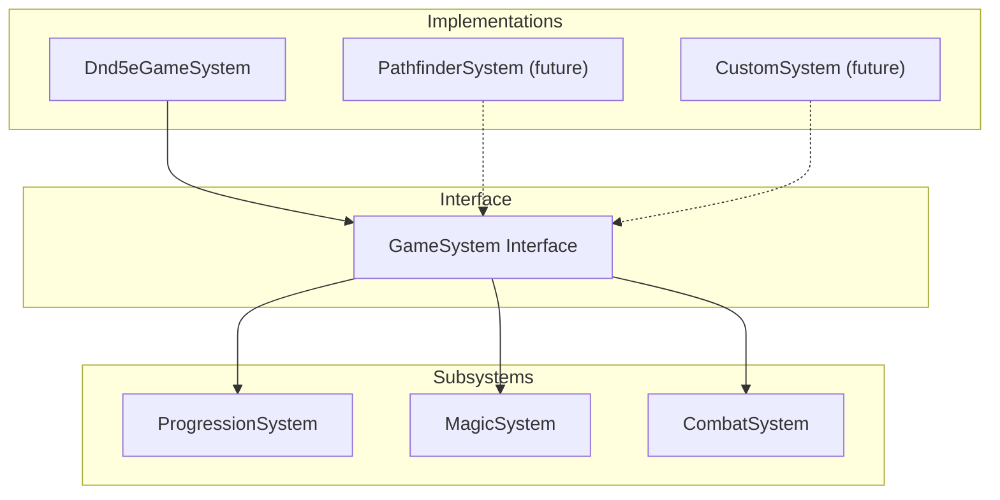

# Game System Abstraction

The `GameSystem` interface abstracts all ruleset-specific mechanics, enabling support for multiple game systems (D&D 5e, Pathfinder, custom systems).

## Architecture



## GameSystem Interface

```typescript
// domain/src/system/game-system.ts
interface GameSystem {
  /** System identifier */
  readonly id: string;
  /** System display name */
  readonly name: string;
  /** System version */
  readonly version: string;
  /** System description */
  readonly description: string;

  // Character Creation Data
  readonly races: Record<string, RaceDefinition>;
  readonly classes: Record<string, ClassDefinition>;
  readonly backgrounds: Record<string, BackgroundDefinition>;
  readonly subclasses: Record<string, Record<string, SubclassDefinition>>;

  // Subsystems
  readonly progression: ProgressionSystem;
  readonly magic: MagicSystem;
  readonly combat: CombatSystem;

  // Utility methods
  calculateAbilityModifier(score: number): number;
  calculateProficiencyBonus(level: number): number;

  // Lookup methods
  getRace(raceKey: string): RaceDefinition | undefined;
  getClass(classKey: string): ClassDefinition | undefined;
  getBackground(backgroundKey: string): BackgroundDefinition | undefined;
  getSubclass(classKey: string, subclassKey: string): SubclassDefinition | undefined;
  getSubclassesForClass(classKey: string): Record<string, SubclassDefinition>;
}
```

## Subsystem Interfaces

### ProgressionSystem

Handles XP and leveling:

```typescript
interface ProgressionSystem {
  maxLevel: number;
  xpThresholds: number[];
  proficiencyByLevel: number[];
  crXpRewards: Record<string, number>;
  standardArray: number[];

  getXPThreshold(level: number): number;
  getXPForNextLevel(currentLevel: number): number;
  getProficiencyBonus(level: number): number;
  getXPForCR(cr: string | number): number;
}
```

### MagicSystem

Handles spellcasting mechanics:

```typescript
type CasterType = 'full' | 'half' | 'third' | 'pact' | 'none';
type SpellSlotTable = number[][];

interface MagicSystem {
  spellLevels: number;
  fullCasterSlots: SpellSlotTable;
  halfCasterSlots: SpellSlotTable;
  casterTypes: Record<string, CasterType>;
  spellcastingAbility: Record<string, keyof AbilityScores>;
  cantripsKnown: Record<string, number[]>;

  getSpellSlots(className: string, level: number): number[];
  getCasterType(className: string): CasterType;
  getSpellcastingAbility(className: string): keyof AbilityScores | undefined;
}
```

### CombatSystem

Handles combat mechanics:

```typescript
interface CombatSystem {
  damageTypes: string[];
  conditions: string[];
  diceTypes: number[];

  calculateAbilityModifier(score: number): number;
  calculateSpellSaveDC(abilityScore: number, proficiencyBonus: number): number;
  calculateSpellAttackBonus(abilityScore: number, proficiencyBonus: number): number;
}
```

## Character Options

### Race Definition

```typescript
interface RaceDefinition {
  name: string;
  abilityBonuses: Partial<AbilityScores>;
  size: 'Tiny' | 'Small' | 'Medium' | 'Large' | 'Huge' | 'Gargantuan';
  speed: number;
  traits: string[];
  languages: string[];
  additionalAbilityBonuses?: {
    count: number;
    amount: number;
    excludes?: (keyof AbilityScores)[];
  };
}
```

### Class Definition

```typescript
interface ClassDefinition {
  name: string;
  hitDie: number;
  primaryAbility: keyof AbilityScores;
  savingThrows: (keyof AbilityScores)[];
  armorProficiencies: string[];
  weaponProficiencies: string[];
  skillChoices: {
    count: number;
    options: string[];
  };
  features: ClassFeature[];
  startingEquipment: string[];
}
```

### Background Definition

```typescript
interface BackgroundDefinition {
  name: string;
  skillProficiencies: string[];
  toolProficiencies: string[];
  languages: number;
  equipment: string[];
  feature: { name: string; description: string };
  traits: string[];
  ideals: string[];
  bonds: string[];
  flaws: string[];
}
```

## Usage

### Getting the D&D 5e System

```typescript
import { getDnd5eSystem } from '@ai-dm/domain';

const system = getDnd5eSystem();

// Access races
const human = system.getRace('human');
console.log(human?.abilityBonuses);  // { strength: 1, dexterity: 1, ... }

// Access classes
const wizard = system.getClass('wizard');
console.log(wizard?.hitDie);  // 6

// Get spell slots for a level 5 wizard
const slots = system.magic.getSpellSlots('wizard', 5);
console.log(slots);  // [4, 3, 2, 0, 0, 0, 0, 0, 0]

// Calculate modifier
const modifier = system.calculateAbilityModifier(16);
console.log(modifier);  // 3
```

### Character Creation

```typescript
import { CharacterBuilder, getDnd5eSystem } from '@ai-dm/domain';

const system = getDnd5eSystem();
const builder = new CharacterBuilder(system);

const character = builder
  .setName('Gandalf')
  .setRace('human')
  .setClass('wizard')
  .setBackground('sage')
  .setAbilityScores({
    strength: 8,
    dexterity: 14,
    constitution: 12,
    intelligence: 16,
    wisdom: 13,
    charisma: 10,
  })
  .build();
```

## Configuration Files

Game systems are defined in JSON configuration files:

```
data/systems/dnd5e/
├── system.json       # System metadata
├── races.json        # Race definitions
├── classes.json      # Class definitions
├── subclasses.json   # Subclass features
├── backgrounds.json  # Background definitions
├── progression.json  # XP tables, proficiency
└── spell-slots.json  # Spell slot progression
```

### Example: system.json

```json
{
  "id": "dnd5e",
  "name": "D&D 5th Edition",
  "version": "1.0.0",
  "description": "Dungeons & Dragons 5th Edition SRD",
  "source": "System Reference Document",
  "files": {
    "races": "races.json",
    "classes": "classes.json",
    "backgrounds": "backgrounds.json",
    "progression": "progression.json",
    "spellSlots": "spell-slots.json"
  },
  "mechanics": {
    "abilityScores": ["strength", "dexterity", "constitution", "intelligence", "wisdom", "charisma"],
    "diceTypes": [4, 6, 8, 10, 12, 20],
    "maxLevel": 20,
    "maxSpellLevel": 9
  }
}
```

## Extending for New Systems

To add a new game system:

1. Create config files in `data/systems/<system-id>/`
2. Implement `GameSystem` interface
3. Register with the system loader

```typescript
// Example: Pathfinder 2e (future)
class Pathfinder2eSystem implements GameSystem {
  readonly id = 'pf2e';
  readonly name = 'Pathfinder 2nd Edition';
  // ... implement interface
}
```

## Related Documentation

- [D&D 5e Implementation](DnD-5e-Implementation.md) - SRD implementation details
- [Character System](Character-System.md) - Character creation
- [Combat System](Combat-System.md) - Combat mechanics
- [Magic System](Magic-System.md) - Spellcasting
