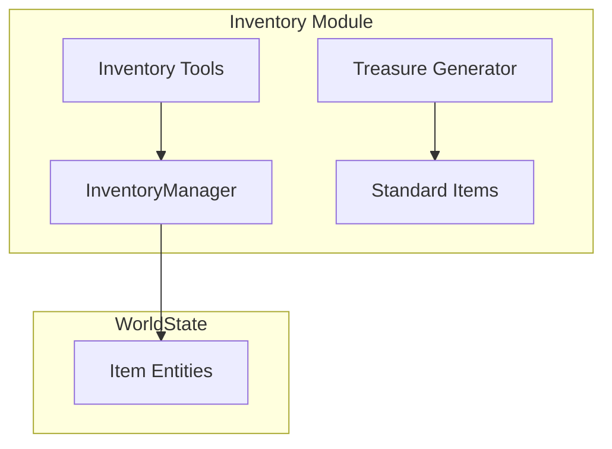

# Inventory System

The inventory system handles items, equipment, currency, and carrying capacity.

## Architecture



## Data Structures

### CharacterInventory

```typescript
interface CharacterInventory {
  equipped: EquippedItems;
  backpack: EntityId[];
  currency: Currency;
  carryingCapacity: number;
  currentWeight: number;
}

interface EquippedItems {
  mainHand?: EntityId;
  offHand?: EntityId;
  armor?: EntityId;
  head?: EntityId;
  cloak?: EntityId;
  neck?: EntityId;
  ring1?: EntityId;
  ring2?: EntityId;
  belt?: EntityId;
  boots?: EntityId;
  gloves?: EntityId;
}

interface Currency {
  copper: number;
  silver: number;
  electrum: number;
  gold: number;
  platinum: number;
}
```

### ItemEntity

```typescript
interface ItemEntity extends BaseEntity {
  type: 'item';
  itemType: 'weapon' | 'armor' | 'consumable' | 'treasure' | 'misc' | 'tool' | 'gear';
  value?: number;
  weight?: number;
  magical?: boolean;
  properties?: string[];
  weaponDetails?: WeaponDetails;
  armorDetails?: ArmorDetails;
  consumableDetails?: ConsumableDetails;
}
```

### Weapon Details

```typescript
interface WeaponDetails {
  category: 'simple' | 'martial';
  weaponType: 'melee' | 'ranged';
  damageDice: string;
  damageType: DamageType;
  properties: WeaponProperty[];
  range?: { normal: number; long?: number };
  versatileDice?: string;
}

type WeaponProperty = 
  | 'ammunition' | 'finesse' | 'heavy' | 'light'
  | 'loading' | 'reach' | 'thrown' | 'two-handed'
  | 'versatile' | 'silvered';
```

### Armor Details

```typescript
interface ArmorDetails {
  armorType: 'light' | 'medium' | 'heavy' | 'shield';
  baseAC: number;
  maxDexBonus?: number;  // undefined = unlimited
  strengthRequirement?: number;
  stealthDisadvantage?: boolean;
}
```

## InventoryManager

```typescript
// domain/src/inventory/inventory-manager.ts
class InventoryManager {
  constructor(private worldState: WorldState) {}
  
  getItem(itemId: EntityId): ItemEntity | undefined {
    const entity = this.worldState.entities.get(itemId);
    return entity?.type === 'item' ? entity : undefined;
  }
  
  addToBackpack(inventory: CharacterInventory, itemId: EntityId): Result {
    const item = this.getItem(itemId);
    if (!item) return { success: false, message: 'Item not found' };
    
    // Check weight
    const newWeight = inventory.currentWeight + (item.weight ?? 0);
    if (newWeight > inventory.carryingCapacity) {
      return { success: false, message: 'Over carrying capacity' };
    }
    
    inventory.backpack.push(itemId);
    inventory.currentWeight = newWeight;
    return { success: true, message: `Added ${item.name}` };
  }
  
  removeFromBackpack(inventory: CharacterInventory, itemId: EntityId): Result {
    const index = inventory.backpack.indexOf(itemId);
    if (index === -1) return { success: false, message: 'Item not in backpack' };
    
    const item = this.getItem(itemId);
    inventory.backpack.splice(index, 1);
    inventory.currentWeight -= item?.weight ?? 0;
    return { success: true, message: `Removed ${item?.name}` };
  }
  
  equipItem(
    inventory: CharacterInventory,
    itemId: EntityId,
    slot?: EquipmentSlot
  ): Result {
    const item = this.getItem(itemId);
    if (!item) return { success: false, message: 'Item not found' };
    
    // Determine slot if not specified
    const targetSlot = slot ?? this.inferSlot(item);
    if (!targetSlot) return { success: false, message: 'Cannot equip this item' };
    
    // Unequip current item in slot
    const currentId = inventory.equipped[targetSlot];
    if (currentId) {
      inventory.backpack.push(currentId);
    }
    
    // Remove from backpack and equip
    this.removeFromBackpack(inventory, itemId);
    inventory.equipped[targetSlot] = itemId;
    
    return { success: true, message: `Equipped ${item.name}` };
  }
  
  calculateArmorClass(inventory: CharacterInventory, dexMod: number): number {
    const armor = inventory.equipped.armor 
      ? this.getItem(inventory.equipped.armor) 
      : undefined;
    const shield = inventory.equipped.offHand
      ? this.getItem(inventory.equipped.offHand)
      : undefined;
    
    let ac = 10 + dexMod;  // Unarmored
    
    if (armor?.armorDetails) {
      const details = armor.armorDetails;
      ac = details.baseAC;
      
      // Apply DEX bonus based on armor type
      if (details.armorType === 'light') {
        ac += dexMod;
      } else if (details.armorType === 'medium') {
        ac += Math.min(dexMod, details.maxDexBonus ?? 2);
      }
      // Heavy armor: no DEX bonus
    }
    
    // Shield bonus
    if (shield?.armorDetails?.armorType === 'shield') {
      ac += shield.armorDetails.baseAC;
    }
    
    return ac;
  }
}
```

## Standard Items

Pre-defined item templates:

```typescript
// domain/src/inventory/standard-items.ts

const WEAPONS: Record<string, Partial<ItemEntity>> = {
  longsword: {
    name: 'Longsword',
    itemType: 'weapon',
    value: 15,
    weight: 3,
    weaponDetails: {
      category: 'martial',
      weaponType: 'melee',
      damageDice: '1d8',
      damageType: 'slashing',
      properties: ['versatile'],
      versatileDice: '1d10',
    },
  },
  dagger: {
    name: 'Dagger',
    itemType: 'weapon',
    value: 2,
    weight: 1,
    weaponDetails: {
      category: 'simple',
      weaponType: 'melee',
      damageDice: '1d4',
      damageType: 'piercing',
      properties: ['finesse', 'light', 'thrown'],
      range: { normal: 20, long: 60 },
    },
  },
};

const ARMOR: Record<string, Partial<ItemEntity>> = {
  leather: {
    name: 'Leather Armor',
    itemType: 'armor',
    value: 10,
    weight: 10,
    armorDetails: {
      armorType: 'light',
      baseAC: 11,
    },
  },
  chainmail: {
    name: 'Chain Mail',
    itemType: 'armor',
    value: 75,
    weight: 55,
    armorDetails: {
      armorType: 'heavy',
      baseAC: 16,
      strengthRequirement: 13,
      stealthDisadvantage: true,
    },
  },
};

const CONSUMABLES: Record<string, Partial<ItemEntity>> = {
  healingPotion: {
    name: 'Potion of Healing',
    itemType: 'consumable',
    value: 50,
    weight: 0.5,
    consumableDetails: {
      uses: 1,
      maxUses: 1,
      effect: 'Regain 2d4+2 hit points',
      healingDice: '2d4+2',
    },
  },
};
```

## Inventory Tools

### give_item

```typescript
const giveItemTool = {
  name: 'give_item',
  description: 'Give an item to the player character.',
  parameters: {
    type: 'object',
    properties: {
      itemName: { type: 'string', description: 'Item name (e.g., "longsword")' },
      quantity: { type: 'number', description: 'Number of items (default 1)' },
    },
    required: ['itemName'],
  },
};
```

### equip_item

```typescript
const equipItemTool = {
  name: 'equip_item',
  description: 'Equip an item from the backpack.',
  parameters: {
    type: 'object',
    properties: {
      itemName: { type: 'string' },
      slot: { type: 'string', description: 'Equipment slot (optional)' },
    },
    required: ['itemName'],
  },
};
```

### check_inventory

```typescript
const checkInventoryTool = {
  name: 'check_inventory',
  description: 'View equipped items, backpack contents, and currency.',
  parameters: {
    type: 'object',
    properties: {},
    required: [],
  },
};
```

### modify_currency

```typescript
const modifyCurrencyTool = {
  name: 'modify_currency',
  description: 'Add or remove currency from the player.',
  parameters: {
    type: 'object',
    properties: {
      gold: { type: 'number' },
      silver: { type: 'number' },
      copper: { type: 'number' },
      action: { type: 'string', enum: ['add', 'remove'] },
    },
    required: ['action'],
  },
};
```

## Treasure Generator

DMG-accurate loot generation:

```typescript
interface TreasureResult {
  currency: Currency;
  items: ItemEntity[];
  description: string;
}

function generateTreasure(
  cr: number,
  hoardType: 'individual' | 'hoard' = 'individual'
): TreasureResult {
  // Roll on appropriate table based on CR
  // Generate currency
  // Roll for magic items on hoard tables
}
```

## Related Documentation

- [Character System](Character-System.md) - Character inventory
- [Combat System](Combat-System.md) - Equipment in combat
- [Procedural Generation](../world-building/Procedural-Generation.md) - Treasure tables
- [DM Tools Reference](../api-reference/DM-Tools.md) - Inventory tools
