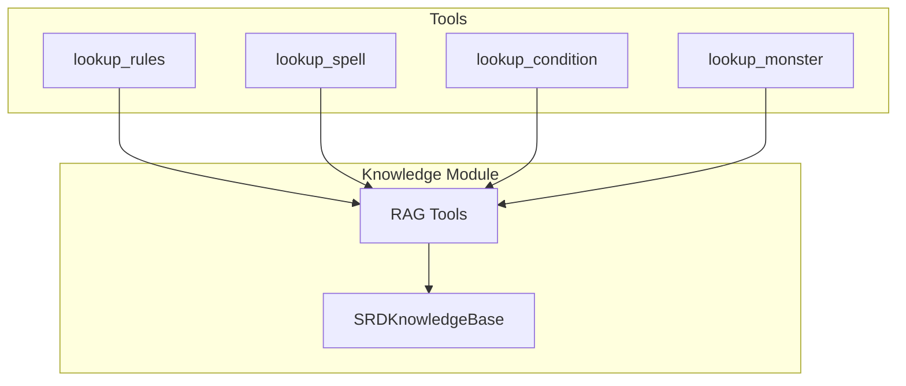

# Knowledge Base

The knowledge base provides RAG (Retrieval-Augmented Generation) capabilities for rules lookup during gameplay.

## Architecture



## SRDKnowledgeBase

The knowledge base stores indexed rule entries:

```typescript
// domain/src/knowledge/srd-knowledge-base.ts

interface KnowledgeEntry {
  id: string;
  category: string;
  title: string;
  content: string;
  keywords: string[];
}

class SRDKnowledgeBase {
  private entries: KnowledgeEntry[];
  
  constructor() {
    this.entries = this.loadSRDContent();
  }
  
  /**
   * Search for relevant entries
   */
  search(query: string, limit: number = 3): KnowledgeEntry[] {
    const queryTerms = this.tokenize(query.toLowerCase());
    
    const scored = this.entries.map(entry => ({
      entry,
      score: this.calculateRelevance(entry, queryTerms),
    }));
    
    return scored
      .filter(s => s.score > 0)
      .sort((a, b) => b.score - a.score)
      .slice(0, limit)
      .map(s => s.entry);
  }
  
  /**
   * Format results for LLM context
   */
  formatForContext(entries: KnowledgeEntry[]): string {
    return entries
      .map(e => `## ${e.title}\n\n${e.content}`)
      .join('\n\n---\n\n');
  }
  
  private calculateRelevance(entry: KnowledgeEntry, queryTerms: string[]): number {
    let score = 0;
    
    // Check title match
    const titleLower = entry.title.toLowerCase();
    for (const term of queryTerms) {
      if (titleLower.includes(term)) score += 3;
    }
    
    // Check keyword match
    for (const keyword of entry.keywords) {
      for (const term of queryTerms) {
        if (keyword.includes(term) || term.includes(keyword)) {
          score += 2;
        }
      }
    }
    
    // Check content match
    const contentLower = entry.content.toLowerCase();
    for (const term of queryTerms) {
      if (contentLower.includes(term)) score += 1;
    }
    
    return score;
  }
  
  private tokenize(text: string): string[] {
    return text
      .toLowerCase()
      .split(/\s+/)
      .filter(word => word.length > 2);
  }
}
```

## Knowledge Categories

The SRD content is organized into categories:

| Category | Content |
|----------|---------|
| Combat | Attack rules, actions, movement |
| Conditions | Status effect definitions |
| Spells | Spell descriptions |
| Monsters | Creature stat blocks |
| Equipment | Weapons, armor, items |
| Abilities | Ability checks, skills |
| Magic Items | Magic item descriptions |
| Rules | General gameplay rules |

## RAG Tools

### lookup_rules

General rules search:

```typescript
const lookupRulesTool = {
  name: 'lookup_rules',
  description: `Search D&D 5e rules for relevant information. 
Use when verifying rules for ability checks, combat, spells, or conditions.`,
  parameters: {
    type: 'object',
    properties: {
      query: {
        type: 'string',
        description: 'What rules to search for (e.g., "grappling", "death saves")',
      },
    },
    required: ['query'],
  },
};

// Handler
async function handleLookupRules({ query }: { query: string }): Promise<string> {
  const results = knowledgeBase.search(query, 3);
  
  if (results.length === 0) {
    return `No specific rules found for "${query}". Use general D&D 5e knowledge.`;
  }
  
  return knowledgeBase.formatForContext(results);
}
```

### lookup_spell

Specific spell lookup:

```typescript
const lookupSpellTool = {
  name: 'lookup_spell',
  description: `Look up spell details including casting time, range, components, and effects.`,
  parameters: {
    type: 'object',
    properties: {
      spellName: { type: 'string', description: 'Name of the spell' },
    },
    required: ['spellName'],
  },
};
```

### lookup_condition

Condition effect lookup:

```typescript
const lookupConditionTool = {
  name: 'lookup_condition',
  description: `Look up the effects of a condition (blinded, prone, grappled, etc.).`,
  parameters: {
    type: 'object',
    properties: {
      condition: { type: 'string', description: 'Condition name' },
    },
    required: ['condition'],
  },
};
```

### lookup_monster

Monster stat block lookup:

```typescript
const lookupMonsterTool = {
  name: 'lookup_monster',
  description: `Look up a monster's stat block including AC, HP, abilities, and attacks.`,
  parameters: {
    type: 'object',
    properties: {
      monsterName: { type: 'string', description: 'Monster name' },
    },
    required: ['monsterName'],
  },
};
```

## Example Entries

### Condition Entry

```typescript
{
  id: 'conditions',
  category: 'Conditions',
  title: 'Conditions',
  content: `
BLINDED: A blinded creature can't see and automatically fails any ability check that requires sight. Attack rolls against the creature have advantage, and the creature's attack rolls have disadvantage.

CHARMED: A charmed creature can't attack the charmer or target the charmer with harmful abilities or magical effects. The charmer has advantage on any ability check to interact socially with the creature.

FRIGHTENED: A frightened creature has disadvantage on ability checks and attack rolls while the source of its fear is within line of sight. The creature can't willingly move closer to the source of its fear.
...`,
  keywords: ['blinded', 'charmed', 'frightened', 'grappled', 'incapacitated', ...]
}
```

### Spell Entry

```typescript
{
  id: 'spell-fireball',
  category: 'Spells',
  title: 'Fireball',
  content: `
3rd-level evocation
Casting Time: 1 action
Range: 150 feet
Components: V, S, M (a tiny ball of bat guano and sulfur)
Duration: Instantaneous

A bright streak flashes from your pointing finger to a point you choose within range and then blossoms with a low roar into an explosion of flame. Each creature in a 20-foot-radius sphere centered on that point must make a Dexterity saving throw. A target takes 8d6 fire damage on a failed save, or half as much damage on a successful one.

At Higher Levels: When you cast this spell using a spell slot of 4th level or higher, the damage increases by 1d6 for each slot level above 3rd.`,
  keywords: ['fireball', 'fire', 'evocation', 'damage', 'aoe', 'dex save']
}
```

## Usage in System Prompts

The DM uses knowledge base results to make accurate rulings:

```typescript
// Build prompt with rule lookup
const systemPrompt = `
You are an AI Dungeon Master. Use the following rules when adjudicating:

${knowledgeBase.formatForContext(relevantRules)}

Always reference these rules when making rulings.
`;
```

## Performance Considerations

- Entries are loaded once at startup
- Simple keyword matching (no vector embeddings yet)
- Results are cached for repeated queries
- Limit results to prevent context overflow

## Future Improvements

- Vector embeddings for semantic search
- Lazy loading of large rule sets
- User-contributed content
- Integration with official D&D Beyond API

## Related Documentation

- [Magic System](Magic-System.md) - Spell lookup integration
- [Combat System](Combat-System.md) - Rules during combat
- [Conditions Manager](Conditions-Manager.md) - Condition effects
- [LLM Integration](../architecture/LLM-Integration.md) - Context building
