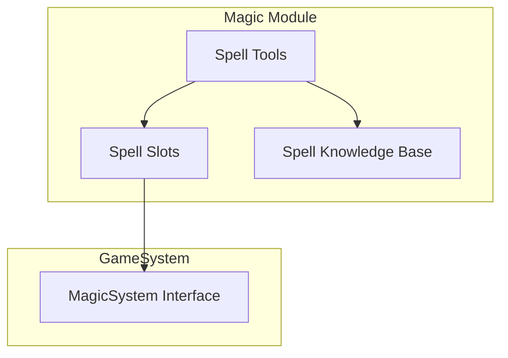

# Magic System

The magic system handles spell slots, spellcasting, and magical effects.

## Architecture



## Spellcasting Data

```typescript
interface CharacterSpellcasting {
  /** Spellcasting ability */
  ability: keyof AbilityScores;
  /** Spell save DC = 8 + proficiency + ability mod */
  spellSaveDC: number;
  /** Spell attack bonus = proficiency + ability mod */
  spellAttackBonus: number;
  /** Available spell slots */
  slots: SpellSlots;
  /** Cantrips known */
  cantripsKnown: string[];
  /** Spells known (for spontaneous casters) */
  spellsKnown: string[];
  /** Prepared spells (for prepared casters) */
  preparedSpells: string[];
  /** Maximum prepared spells */
  maxPreparedSpells: number;
}

interface SpellSlots {
  /** Current slots per level (index 0 = 1st, index 8 = 9th) */
  current: [number, number, number, number, number, number, number, number, number];
  /** Maximum slots per level */
  max: [number, number, number, number, number, number, number, number, number];
}
```

## Spell Slot Progression

### Full Casters (Wizard, Cleric)

| Level | 1st | 2nd | 3rd | 4th | 5th | 6th | 7th | 8th | 9th |
|-------|-----|-----|-----|-----|-----|-----|-----|-----|-----|
| 1 | 2 | - | - | - | - | - | - | - | - |
| 2 | 3 | - | - | - | - | - | - | - | - |
| 3 | 4 | 2 | - | - | - | - | - | - | - |
| 4 | 4 | 3 | - | - | - | - | - | - | - |
| 5 | 4 | 3 | 2 | - | - | - | - | - | - |
| 6 | 4 | 3 | 3 | - | - | - | - | - | - |
| 7 | 4 | 3 | 3 | 1 | - | - | - | - | - |
| 8 | 4 | 3 | 3 | 2 | - | - | - | - | - |
| 9 | 4 | 3 | 3 | 3 | 1 | - | - | - | - |
| 10 | 4 | 3 | 3 | 3 | 2 | - | - | - | - |

### Half Casters (Paladin, Ranger)

| Level | 1st | 2nd | 3rd | 4th | 5th |
|-------|-----|-----|-----|-----|-----|
| 2 | 2 | - | - | - | - |
| 3 | 3 | - | - | - | - |
| 5 | 4 | 2 | - | - | - |
| 7 | 4 | 3 | - | - | - |
| 9 | 4 | 3 | 2 | - | - |

## Spell Slot Functions

```typescript
// domain/src/magic/spell-slots.ts

/**
 * Check if character can cast a spell at a given level
 */
function canCastSpell(spellcasting: CharacterSpellcasting, level: number): boolean {
  if (level === 0) {
    // Cantrips don't use slots
    return true;
  }
  if (level < 1 || level > 9) {
    return false;
  }
  return spellcasting.slots.current[level - 1] > 0;
}

/**
 * Consume a spell slot
 */
function consumeSpellSlot(spellcasting: CharacterSpellcasting, level: number): boolean {
  if (!canCastSpell(spellcasting, level)) {
    return false;
  }
  if (level > 0) {
    spellcasting.slots.current[level - 1] -= 1;
  }
  return true;
}

/**
 * Reset spell slots (long rest)
 */
function resetSpellSlots(spellcasting: CharacterSpellcasting): void {
  spellcasting.slots.current = [...spellcasting.slots.max];
}

/**
 * Format spell slots for display
 */
function formatSpellSlots(spellcasting: CharacterSpellcasting): string {
  let result = `Spellcasting (${spellcasting.ability.toUpperCase()})\n`;
  result += `Spell Save DC: ${spellcasting.spellSaveDC}\n`;
  result += `Spell Attack: +${spellcasting.spellAttackBonus}\n\n`;
  result += `Spell Slots:\n`;
  
  for (let i = 0; i < 9; i++) {
    if (spellcasting.slots.max[i] > 0) {
      result += `  ${i + 1}${getOrdinal(i + 1)}: ${spellcasting.slots.current[i]}/${spellcasting.slots.max[i]}\n`;
    }
  }
  
  return result;
}
```

## Spellcasting Ability by Class

| Class | Ability |
|-------|---------|
| Wizard | Intelligence |
| Cleric | Wisdom |
| Sorcerer | Charisma |
| Bard | Charisma |
| Warlock | Charisma |
| Druid | Wisdom |
| Paladin | Charisma |
| Ranger | Wisdom |

## Calculating Spell Stats

```typescript
function initializeSpellcasting(
  character: CharacterSheet,
  className: string,
  system: GameSystem
): CharacterSpellcasting {
  const ability = system.magic.getSpellcastingAbility(className);
  if (!ability) throw new Error(`${className} is not a spellcaster`);
  
  const abilityMod = system.calculateAbilityModifier(
    character.stats.abilityScores[ability]
  );
  const profBonus = system.progression.getProficiencyBonus(character.level);
  
  const slots = system.magic.getSpellSlots(className, character.level);
  
  return {
    ability,
    spellSaveDC: 8 + profBonus + abilityMod,
    spellAttackBonus: profBonus + abilityMod,
    slots: {
      current: slots as any,
      max: slots as any,
    },
    cantripsKnown: [],
    spellsKnown: [],
    preparedSpells: [],
    maxPreparedSpells: Math.max(1, abilityMod + character.level),
  };
}
```

## Spell Tools

DM tools for spellcasting:

### cast_spell

Cast a spell, consuming the appropriate slot:

```typescript
const tool = {
  name: 'cast_spell',
  description: 'Cast a spell, consuming the appropriate spell slot.',
  parameters: {
    type: 'object',
    properties: {
      spellName: { type: 'string' },
      spellLevel: { type: 'number' },  // Base level (0 for cantrip)
      upcastLevel: { type: 'number' }, // Optional: cast at higher level
    },
    required: ['spellName', 'spellLevel'],
  },
};
```

### check_spell_slots

View current spell slot status:

```typescript
const tool = {
  name: 'check_spell_slots',
  description: 'View spell slots, DC, and prepared spells.',
  parameters: {
    type: 'object',
    properties: {},
    required: [],
  },
};
```

### lookup_spell

Look up spell details from knowledge base:

```typescript
const tool = {
  name: 'lookup_spell',
  description: 'Look up spell details including casting time, range, and effects.',
  parameters: {
    type: 'object',
    properties: {
      spellName: { type: 'string' },
    },
    required: ['spellName'],
  },
};
```

## Spell Knowledge Base

The SRD spell database supports RAG-style lookups:

```typescript
interface SpellInfo {
  name: string;
  level: number;  // 0 = cantrip
  school: SpellSchool;
  castingTime: string;
  range: string;
  components: string;
  duration: string;
  concentration: boolean;
  description: string;
}

type SpellSchool = 
  | 'abjuration' | 'conjuration' | 'divination' | 'enchantment'
  | 'evocation' | 'illusion' | 'necromancy' | 'transmutation';
```

### Example Spell Entry

```json
{
  "name": "Fireball",
  "level": 3,
  "school": "evocation",
  "castingTime": "1 action",
  "range": "150 feet",
  "components": "V, S, M (a tiny ball of bat guano and sulfur)",
  "duration": "Instantaneous",
  "concentration": false,
  "description": "A bright streak flashes from your pointing finger to a point you choose within range and then blossoms with a low roar into an explosion of flame. Each creature in a 20-foot-radius sphere centered on that point must make a Dexterity saving throw. A target takes 8d6 fire damage on a failed save, or half as much damage on a successful one."
}
```

## Concentration

Spells with concentration require tracking:

```typescript
function applyConcentration(character: CharacterSheet, spellName: string): void {
  // End any existing concentration
  if (character.concentration) {
    endConcentration(character);
  }
  character.concentration = spellName;
}

function concentrationCheck(
  character: CharacterSheet,
  damage: number,
  system: GameSystem
): { maintained: boolean; roll: number; dc: number } {
  const dc = Math.max(10, Math.floor(damage / 2));
  const conMod = system.calculateAbilityModifier(
    character.stats.abilityScores.constitution
  );
  const roll = rollD20() + conMod;
  
  const maintained = roll >= dc;
  if (!maintained) {
    endConcentration(character);
  }
  
  return { maintained, roll, dc };
}
```

## Related Documentation

- [Game System Abstraction](Game-System-Abstraction.md) - MagicSystem interface
- [Knowledge Base](Knowledge-Base.md) - Spell lookup system
- [Combat System](Combat-System.md) - Spells in combat
- [DM Tools Reference](../api-reference/DM-Tools.md) - Spell tools
