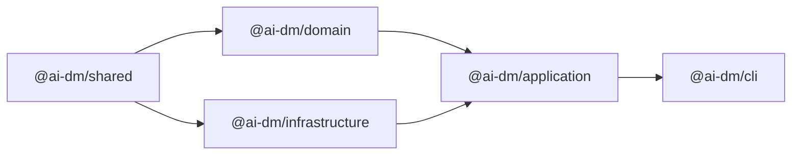

# Building

This document describes the build process for Squadventure.

## Build Commands

```bash
# Build all packages
pnpm build

# Build specific package
pnpm --filter @ai-dm/domain build

# Clean build (remove dist directories)
rm -rf packages/*/dist && pnpm build

# Type check without emitting
pnpm typecheck
```

## Build Order

Packages are built in dependency order:



1. `@ai-dm/shared` - Type definitions (no dependencies)
2. `@ai-dm/domain` - Game logic (depends on shared)
3. `@ai-dm/infrastructure` - External services (depends on shared)
4. `@ai-dm/application` - Orchestration (depends on domain, infrastructure)
5. `@ai-dm/cli` - CLI interface (depends on application)

## TypeScript Configuration

### Root tsconfig.json

```json
{
  "compilerOptions": {
    "target": "ES2022",
    "module": "NodeNext",
    "moduleResolution": "NodeNext",
    "strict": true,
    "esModuleInterop": true,
    "skipLibCheck": true,
    "forceConsistentCasingInFileNames": true,
    "declaration": true,
    "declarationMap": true,
    "sourceMap": true
  }
}
```

### Package tsconfig.json

Each package extends the root:

```json
{
  "extends": "../../tsconfig.json",
  "compilerOptions": {
    "outDir": "dist",
    "rootDir": "src"
  },
  "include": ["src"],
  "references": [
    { "path": "../shared" }
  ]
}
```

## Package Structure

Each package follows a standard structure:

```
packages/example/
├── src/
│   ├── index.ts          # Barrel exports
│   ├── module/
│   │   ├── index.ts
│   │   └── implementation.ts
│   └── types.ts
├── dist/                  # Build output (gitignored)
│   ├── index.js
│   ├── index.d.ts
│   └── ...
├── package.json
└── tsconfig.json
```

### package.json

```json
{
  "name": "@ai-dm/example",
  "version": "0.0.1",
  "type": "module",
  "main": "dist/index.js",
  "types": "dist/index.d.ts",
  "exports": {
    ".": {
      "types": "./dist/index.d.ts",
      "import": "./dist/index.js"
    }
  },
  "scripts": {
    "build": "tsc",
    "typecheck": "tsc --noEmit"
  },
  "dependencies": {
    "@ai-dm/shared": "workspace:*"
  }
}
```

## ESM Modules

The project uses ES Modules exclusively:

```typescript
// ✅ Correct - Use .js extension
import { Entity } from './types.js';
import { CombatManager } from '../combat/index.js';

// ❌ Wrong - No extension
import { Entity } from './types';
```

## Watch Mode

For development, use watch mode:

```bash
# Watch all packages (parallel)
pnpm -r --parallel exec tsc --watch

# Watch specific package
pnpm --filter @ai-dm/domain exec tsc --watch
```

## Build Scripts

### Full Build

```bash
#!/bin/bash
# scripts/build.sh

set -e

echo "Building @ai-dm/shared..."
pnpm --filter @ai-dm/shared build

echo "Building @ai-dm/domain..."
pnpm --filter @ai-dm/domain build

echo "Building @ai-dm/infrastructure..."
pnpm --filter @ai-dm/infrastructure build

echo "Building @ai-dm/application..."
pnpm --filter @ai-dm/application build

echo "Building @ai-dm/cli..."
pnpm --filter @ai-dm/cli build

echo "Build complete!"
```

### Clean Build

```bash
#!/bin/bash
# scripts/clean-build.sh

echo "Cleaning dist directories..."
rm -rf packages/*/dist

echo "Running full build..."
pnpm build
```

## CI/CD

### GitHub Actions

```yaml
# .github/workflows/ci.yml
name: CI

on: [push, pull_request]

jobs:
  build:
    runs-on: ubuntu-latest
    steps:
      - uses: actions/checkout@v4
      
      - uses: pnpm/action-setup@v2
        with:
          version: 10
          
      - uses: actions/setup-node@v4
        with:
          node-version: '20'
          cache: 'pnpm'
          
      - run: pnpm install
      - run: pnpm build
      - run: pnpm typecheck
      - run: pnpm test
```

## Troubleshooting

### "Cannot find module" Errors

```bash
# Rebuild dependencies
pnpm --filter @ai-dm/shared build
pnpm build
```

### Type Errors in Dependencies

```bash
# Clear TypeScript cache
rm -rf node_modules/.cache
pnpm typecheck
```

### Stale Build Output

```bash
# Clean and rebuild
rm -rf packages/*/dist
pnpm build
```

### Declaration File Errors

Ensure `declaration: true` in tsconfig:

```json
{
  "compilerOptions": {
    "declaration": true,
    "declarationMap": true
  }
}
```

## Performance

### Incremental Builds

TypeScript incremental builds are enabled:

```json
{
  "compilerOptions": {
    "incremental": true,
    "tsBuildInfoFile": "./dist/.tsbuildinfo"
  }
}
```

### Project References

For faster builds, use project references:

```json
// packages/domain/tsconfig.json
{
  "references": [
    { "path": "../shared" }
  ]
}
```

Then build with:

```bash
tsc --build
```

## Related Documentation

- [Development Setup](Development-Setup.md) - Environment setup
- [Package Structure](../architecture/Package-Structure.md) - Package details
- [Code Conventions](Code-Conventions.md) - Style guide
