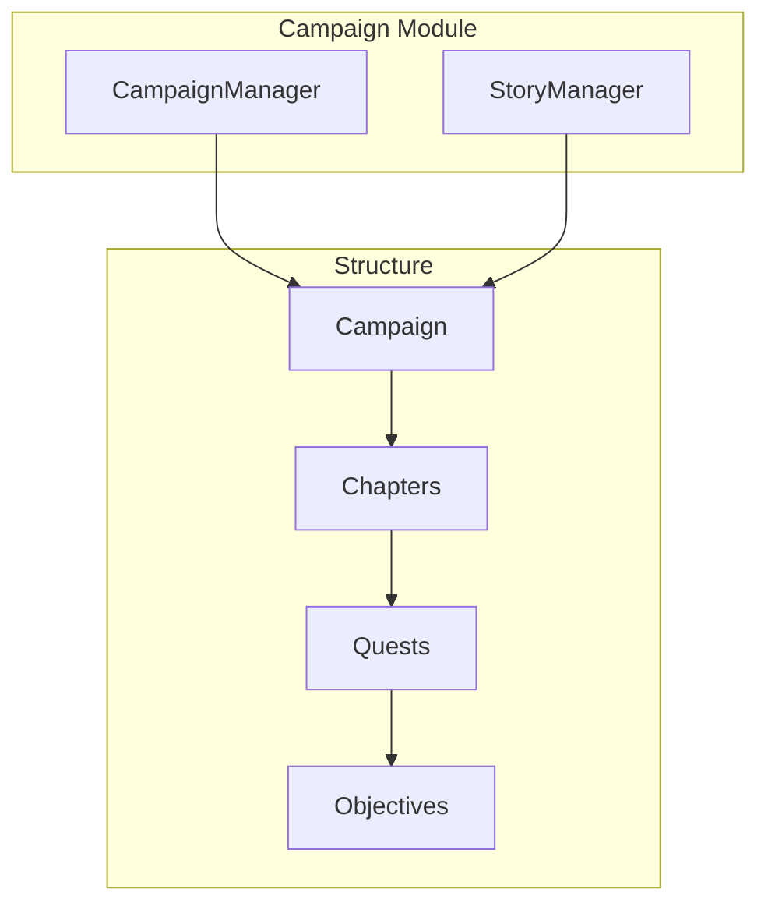

# Campaign System

The campaign system manages story arcs, chapters, quests, and objectives for structured narrative campaigns.

## Architecture



## Campaign Structure

```typescript
// shared/src/types.ts

interface Campaign {
  id: CampaignId;
  name: string;
  description: string;
  introduction: string;
  setting: CampaignSetting;
  levelRange: { min: number; max: number };
  chapters: Chapter[];
  worldStateId: string;
  storyState: StoryState;
  metadata: CampaignMetadata;
}

interface CampaignSetting {
  overlayId?: string;
  name: string;
  description: string;
  startingLocationId?: LocationId;
}

interface CampaignMetadata {
  author?: string;
  version: string;
  tags?: string[];
  estimatedSessions?: number;
  createdAt: Date;
  updatedAt: Date;
}
```

## Chapters

Major story segments:

```typescript
interface Chapter {
  id: ChapterId;
  number: number;
  name: string;
  synopsis: string;
  objectives: Objective[];
  keyLocations: LocationId[];
  keyNPCs: EntityId[];
  suggestedLevel: number;
  questIds: QuestId[];
  status: 'locked' | 'active' | 'completed';
  prerequisites?: {
    completedChapters?: ChapterId[];
    completedObjectives?: ObjectiveId[];
    minLevel?: number;
  };
}
```

### Example Chapter

```typescript
const chapter1: Chapter = {
  id: createChapterId('chapter-1'),
  number: 1,
  name: 'The Gathering Storm',
  synopsis: 'Heroes are drawn together by a mysterious summons to investigate disappearances in the village of Barrow's Edge.',
  objectives: [
    {
      id: createObjectiveId('obj-1-1'),
      title: 'Investigate the disappearances',
      description: 'Speak with villagers and gather clues about the missing people.',
      type: 'main',
      status: 'discovered',
      isRevealed: true,
    },
    {
      id: createObjectiveId('obj-1-2'),
      title: 'Find the hidden entrance',
      description: 'Locate the secret passage beneath the old mill.',
      type: 'main',
      status: 'unknown',
      prerequisites: [createObjectiveId('obj-1-1')],
      isRevealed: false,
    },
  ],
  keyLocations: [
    createLocationId('loc-barrows-edge'),
    createLocationId('loc-old-mill'),
  ],
  keyNPCs: [
    createEntityId('npc-mayor'),
    createEntityId('npc-mysterious-stranger'),
  ],
  suggestedLevel: 1,
  questIds: [createQuestId('quest-missing-people')],
  status: 'active',
};
```

## Quests

Standalone story units:

```typescript
interface Quest {
  id: QuestId;
  name: string;
  description: string;
  questGiverId?: EntityId;
  originLocationId?: LocationId;
  objectives: Objective[];
  status: ObjectiveStatus;
  chapterId?: ChapterId;
  isMainQuest: boolean;
  levelRange?: { min: number; max: number };
  tags?: string[];
  startedAt?: Date;
  endedAt?: Date;
}
```

## Objectives

Individual tasks to complete:

```typescript
type ObjectiveStatus = 'unknown' | 'discovered' | 'active' | 'completed' | 'failed' | 'abandoned';
type ObjectiveType = 'main' | 'side' | 'hidden' | 'bonus';

interface Objective {
  id: ObjectiveId;
  title: string;
  description: string;
  type: ObjectiveType;
  status: ObjectiveStatus;
  prerequisites?: ObjectiveId[];
  rewards?: ObjectiveReward;
  progress?: number;
  hint?: string;
  isRevealed: boolean;
}

interface ObjectiveReward {
  xp?: number;
  gold?: number;
  items?: EntityId[];
  reputation?: Array<{
    factionId: EntityId;
    change: number;
  }>;
  custom?: string;
}
```

## Story State

Tracks narrative progress:

```typescript
interface StoryState {
  currentChapterId?: ChapterId;
  chapters: Chapter[];
  quests: Quest[];
  decisions: PlotDecision[];
  factionReputation: Record<string, number>;
  storyFlags: Record<string, boolean>;
  storyCounters: Record<string, number>;
  discoveredLore: string[];
}

interface PlotDecision {
  id: string;
  description: string;
  choice: string;
  timestamp: Date;
  chapterId?: ChapterId;
  consequences?: string[];
  affectedEntities?: EntityId[];
}
```

## CampaignManager

```typescript
// domain/src/campaign/campaign-manager.ts

class CampaignManager {
  private campaign: Campaign;
  
  constructor(campaign: Campaign) {
    this.campaign = campaign;
  }
  
  /**
   * Get current chapter
   */
  getCurrentChapter(): Chapter | undefined {
    const id = this.campaign.storyState.currentChapterId;
    return this.campaign.chapters.find(c => c.id === id);
  }
  
  /**
   * Start a quest
   */
  startQuest(questId: QuestId): Quest {
    const quest = this.campaign.storyState.quests.find(q => q.id === questId);
    if (!quest) throw new Error(`Quest ${questId} not found`);
    
    quest.status = 'active';
    quest.startedAt = new Date();
    
    // Reveal main objectives
    for (const obj of quest.objectives) {
      if (obj.type === 'main' && !obj.prerequisites?.length) {
        obj.isRevealed = true;
        obj.status = 'active';
      }
    }
    
    return quest;
  }
  
  /**
   * Complete an objective
   */
  completeObjective(objectiveId: ObjectiveId): ObjectiveReward | undefined {
    const objective = this.findObjective(objectiveId);
    if (!objective) return undefined;
    
    objective.status = 'completed';
    
    // Check for unlocked objectives
    this.checkObjectiveUnlocks(objectiveId);
    
    // Check for quest completion
    this.checkQuestCompletion();
    
    // Check for chapter completion
    this.checkChapterCompletion();
    
    return objective.rewards;
  }
  
  /**
   * Record a plot decision
   */
  recordDecision(decision: Omit<PlotDecision, 'timestamp'>): void {
    this.campaign.storyState.decisions.push({
      ...decision,
      timestamp: new Date(),
    });
  }
  
  /**
   * Advance to next chapter
   */
  advanceChapter(): Chapter | undefined {
    const current = this.getCurrentChapter();
    if (!current) return undefined;
    
    current.status = 'completed';
    
    const nextNumber = current.number + 1;
    const next = this.campaign.chapters.find(c => c.number === nextNumber);
    
    if (next && this.canUnlockChapter(next)) {
      next.status = 'active';
      this.campaign.storyState.currentChapterId = next.id;
      return next;
    }
    
    return undefined;
  }
  
  /**
   * Get campaign summary
   */
  getSummary(): CampaignSummary {
    const completedQuests = this.campaign.storyState.quests.filter(
      q => q.status === 'completed'
    ).length;
    
    const current = this.getCurrentChapter();
    
    return {
      id: this.campaign.id,
      name: this.campaign.name,
      description: this.campaign.description,
      levelRange: this.campaign.levelRange,
      chapterCount: this.campaign.chapters.length,
      questCount: this.campaign.storyState.quests.length,
      progress: {
        currentChapter: current?.number ?? 0,
        totalChapters: this.campaign.chapters.length,
        completedQuests,
        totalQuests: this.campaign.storyState.quests.length,
      },
    };
  }
}
```

## Example Campaign Definition

```typescript
const sampleCampaign: Campaign = {
  id: createCampaignId('lost-mines'),
  name: 'Lost Mines of Phandelver',
  description: 'A classic introductory adventure',
  introduction: 'You have been hired to escort a wagon of supplies...',
  setting: {
    name: 'Sword Coast',
    description: 'The western coast of Faerûn',
    startingLocationId: createLocationId('loc-phandalin'),
  },
  levelRange: { min: 1, max: 5 },
  chapters: [chapter1, chapter2, chapter3, chapter4],
  worldStateId: 'world-phandalin',
  storyState: {
    currentChapterId: createChapterId('chapter-1'),
    chapters: [chapter1, chapter2, chapter3, chapter4],
    quests: [],
    decisions: [],
    factionReputation: {},
    storyFlags: {},
    storyCounters: {},
    discoveredLore: [],
  },
  metadata: {
    author: 'Wizards of the Coast',
    version: '1.0.0',
    tags: ['starter', 'dungeon-crawl'],
    estimatedSessions: 8,
    createdAt: new Date(),
    updatedAt: new Date(),
  },
};
```

## Related Documentation

- [World Model](World-Model.md) - World structure
- [NPC Relationships](NPC-Relationships.md) - Faction reputation
- [Domain Model](../architecture/Domain-Model.md) - Campaign types
