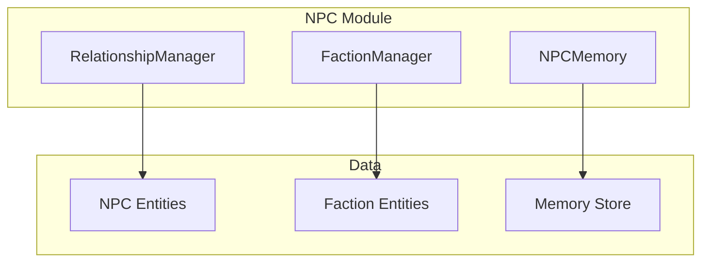

# NPC Relationships

The NPC relationship system tracks NPC memories, attitudes, and faction affiliations to create consistent, evolving characters.

## Architecture



## NPC Memory

NPCs remember interactions:

```typescript
// domain/src/npc/npc-memory.ts

interface NPCMemory {
  npcId: EntityId;
  /** Memories of the player */
  playerMemories: Memory[];
  /** Knowledge this NPC has */
  knowledge: string[];
  /** Attitude toward player */
  attitude: AttitudeLevel;
  /** Significant events */
  events: MemoryEvent[];
}

interface Memory {
  id: string;
  content: string;
  importance: 'trivial' | 'minor' | 'significant' | 'major';
  timestamp: Date;
  emotional: 'positive' | 'neutral' | 'negative';
}

interface MemoryEvent {
  id: string;
  type: 'first_meeting' | 'quest_given' | 'quest_completed' | 'betrayal' | 'gift' | 'combat' | 'conversation';
  description: string;
  timestamp: Date;
  impactOnAttitude: number;
}

type AttitudeLevel = 
  | 'hostile'     // Will attack on sight
  | 'unfriendly'  // Won't help, may hinder
  | 'indifferent' // Default starting attitude
  | 'friendly'    // Will help if convenient
  | 'allied';     // Will go out of way to help
```

## RelationshipManager

```typescript
// domain/src/npc/relationship-manager.ts

class RelationshipManager {
  private memories: Map<EntityId, NPCMemory>;
  
  /**
   * Record a memory for an NPC
   */
  addMemory(npcId: EntityId, memory: Omit<Memory, 'id' | 'timestamp'>): void {
    const npcMemory = this.getOrCreate(npcId);
    npcMemory.playerMemories.push({
      ...memory,
      id: generateId(),
      timestamp: new Date(),
    });
    
    // Adjust attitude based on memory
    this.adjustAttitude(npcId, memory.emotional, memory.importance);
  }
  
  /**
   * Record a significant event
   */
  recordEvent(npcId: EntityId, event: Omit<MemoryEvent, 'id' | 'timestamp'>): void {
    const npcMemory = this.getOrCreate(npcId);
    npcMemory.events.push({
      ...event,
      id: generateId(),
      timestamp: new Date(),
    });
    
    // Apply attitude impact
    this.modifyAttitude(npcId, event.impactOnAttitude);
  }
  
  /**
   * Get NPC's attitude toward player
   */
  getAttitude(npcId: EntityId): AttitudeLevel {
    return this.memories.get(npcId)?.attitude ?? 'indifferent';
  }
  
  /**
   * Check if NPC knows something
   */
  npcKnows(npcId: EntityId, topic: string): boolean {
    const memory = this.memories.get(npcId);
    if (!memory) return false;
    
    return memory.knowledge.some(k => 
      k.toLowerCase().includes(topic.toLowerCase())
    );
  }
  
  /**
   * Get relevant memories for context
   */
  getRelevantMemories(npcId: EntityId, limit: number = 5): Memory[] {
    const npcMemory = this.memories.get(npcId);
    if (!npcMemory) return [];
    
    // Sort by importance and recency
    return npcMemory.playerMemories
      .sort((a, b) => {
        const importanceScore = { major: 4, significant: 3, minor: 2, trivial: 1 };
        const scoreDiff = importanceScore[b.importance] - importanceScore[a.importance];
        if (scoreDiff !== 0) return scoreDiff;
        return b.timestamp.getTime() - a.timestamp.getTime();
      })
      .slice(0, limit);
  }
  
  /**
   * Format memories for DM context
   */
  formatForContext(npcId: EntityId): string {
    const memory = this.memories.get(npcId);
    if (!memory) return 'No prior interactions.';
    
    const memories = this.getRelevantMemories(npcId);
    
    return `
Attitude: ${memory.attitude}
Recent memories:
${memories.map(m => `- ${m.content} (${m.emotional})`).join('\n')}
    `.trim();
  }
}
```

## Faction System

NPCs belong to factions with relationships:

```typescript
// domain/src/npc/faction-manager.ts

interface FactionReputation {
  factionId: EntityId;
  standing: number;  // -100 to 100
  rank?: string;
  benefits: string[];
}

interface FactionRelationship {
  factionId: EntityId;
  attitude: 'allied' | 'friendly' | 'neutral' | 'rival' | 'hostile';
}

class FactionManager {
  private factions: Map<EntityId, FactionEntity>;
  private playerReputation: Map<EntityId, FactionReputation>;
  
  /**
   * Modify player reputation with faction
   */
  modifyReputation(factionId: EntityId, change: number): FactionReputation {
    const rep = this.getOrCreateReputation(factionId);
    rep.standing = Math.max(-100, Math.min(100, rep.standing + change));
    
    // Update rank based on standing
    rep.rank = this.calculateRank(rep.standing);
    rep.benefits = this.getBenefits(factionId, rep.standing);
    
    // Propagate to allied/rival factions
    this.propagateReputation(factionId, change);
    
    return rep;
  }
  
  /**
   * Get player's standing with faction
   */
  getStanding(factionId: EntityId): number {
    return this.playerReputation.get(factionId)?.standing ?? 0;
  }
  
  /**
   * Check if NPC attitude affected by faction
   */
  getAttitudeModifier(npcId: EntityId, worldState: WorldState): number {
    const npc = worldState.entities.get(npcId) as NPCEntity;
    if (!npc?.factionId) return 0;
    
    const standing = this.getStanding(npc.factionId);
    
    // Convert faction standing to attitude modifier
    if (standing >= 50) return 2;  // Very friendly
    if (standing >= 20) return 1;  // Friendly
    if (standing <= -50) return -2; // Hostile
    if (standing <= -20) return -1; // Unfriendly
    return 0;
  }
  
  /**
   * Propagate reputation changes to related factions
   */
  private propagateReputation(factionId: EntityId, change: number): void {
    const faction = this.factions.get(factionId);
    if (!faction) return;
    
    for (const rel of faction.relationships) {
      let propagatedChange = 0;
      
      switch (rel.attitude) {
        case 'allied':
          propagatedChange = change * 0.5;
          break;
        case 'friendly':
          propagatedChange = change * 0.25;
          break;
        case 'rival':
          propagatedChange = change * -0.25;
          break;
        case 'hostile':
          propagatedChange = change * -0.5;
          break;
      }
      
      if (propagatedChange !== 0) {
        const rep = this.getOrCreateReputation(rel.factionId);
        rep.standing = Math.max(-100, Math.min(100, rep.standing + propagatedChange));
      }
    }
  }
}
```

## Faction Ranks

| Standing | Rank | Effects |
|----------|------|---------|
| 80-100 | Exalted | Special quests, best prices |
| 50-79 | Honored | Discounts, safe houses |
| 20-49 | Friendly | Basic services |
| -19-19 | Neutral | Standard treatment |
| -49--20 | Unfriendly | Higher prices, limited services |
| -79--50 | Hostile | Refused service |
| -100--80 | Enemy | Attack on sight |

## Integration with DM

NPC memories inform roleplaying:

```typescript
function buildNPCContext(npcId: EntityId): string {
  const npc = worldState.entities.get(npcId) as NPCEntity;
  const memories = relationshipManager.formatForContext(npcId);
  const factionMod = factionManager.getAttitudeModifier(npcId, worldState);
  
  return `
## NPC: ${npc.name}

Personality: ${npc.personality.traits.join(', ')}
Motivation: ${npc.motivation}
Speaking style: ${npc.personality.speakingStyle}

Player relationship:
${memories}

Faction influence: ${factionMod > 0 ? '+' : ''}${factionMod} to attitude

Remember their previous interactions when roleplaying this NPC.
  `.trim();
}
```

## Related Documentation

- [World Model](World-Model.md) - NPC entities
- [Campaign System](Campaign-System.md) - Faction reputation tracking
- [DM Personas](../core-systems/DM-Personas.md) - NPC characterization
