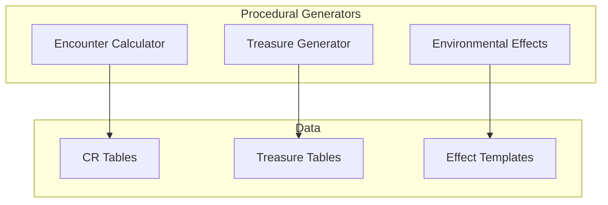

# Procedural Generation

Squadventure includes procedural generation systems for encounters, treasure, and environmental effects, ensuring balanced and varied content.

## Architecture



## Encounter Calculator

DMG-accurate encounter difficulty calculation:

```typescript
// domain/src/combat/encounter-calculator.ts

interface EncounterDifficulty {
  rating: 'Easy' | 'Medium' | 'Hard' | 'Deadly';
  partyThreshold: number;
  adjustedXP: number;
  actualXP: number;
  multiplier: number;
}

class EncounterCalculator {
  /**
   * Calculate encounter difficulty
   */
  calculateDifficulty(
    partyLevels: number[],
    monsterCRs: (string | number)[]
  ): EncounterDifficulty {
    // Get party XP thresholds
    const thresholds = this.getPartyThresholds(partyLevels);
    
    // Calculate monster XP
    const baseXP = monsterCRs.reduce(
      (sum, cr) => sum + this.getXPForCR(cr), 
      0
    );
    
    // Apply encounter multiplier
    const multiplier = this.getEncounterMultiplier(
      monsterCRs.length, 
      partyLevels.length
    );
    const adjustedXP = baseXP * multiplier;
    
    // Determine difficulty rating
    const rating = this.getRating(adjustedXP, thresholds);
    
    return {
      rating,
      partyThreshold: thresholds[rating.toLowerCase()],
      adjustedXP,
      actualXP: baseXP,
      multiplier,
    };
  }
  
  /**
   * Generate a balanced encounter
   */
  generateEncounter(
    partyLevels: number[],
    difficulty: 'Easy' | 'Medium' | 'Hard' | 'Deadly',
    terrain?: string
  ): GeneratedEncounter {
    const targetXP = this.getTargetXP(partyLevels, difficulty);
    const monsters = this.selectMonsters(targetXP, partyLevels, terrain);
    
    return {
      monsters,
      difficulty: this.calculateDifficulty(partyLevels, monsters.map(m => m.cr)),
      terrain,
    };
  }
}
```

### XP Thresholds by Level

| Level | Easy | Medium | Hard | Deadly |
|-------|------|--------|------|--------|
| 1 | 25 | 50 | 75 | 100 |
| 2 | 50 | 100 | 150 | 200 |
| 3 | 75 | 150 | 225 | 400 |
| 4 | 125 | 250 | 375 | 500 |
| 5 | 250 | 500 | 750 | 1,100 |

### Encounter Multipliers

| Monsters | Multiplier |
|----------|------------|
| 1 | ×1 |
| 2 | ×1.5 |
| 3-6 | ×2 |
| 7-10 | ×2.5 |
| 11-14 | ×3 |
| 15+ | ×4 |

## Treasure Generator

DMG-accurate loot tables:

```typescript
// domain/src/inventory/treasure-generator.ts

interface TreasureResult {
  currency: Currency;
  mundaneItems: ItemEntity[];
  magicItems: ItemEntity[];
  description: string;
}

class TreasureGenerator {
  /**
   * Generate individual creature treasure
   */
  generateIndividual(cr: number): TreasureResult {
    const table = this.getIndividualTable(cr);
    const roll = this.roll(100);
    const entry = this.getTableEntry(table, roll);
    
    return {
      currency: this.rollCurrency(entry.currency),
      mundaneItems: [],
      magicItems: [],
      description: this.formatTreasure(entry),
    };
  }
  
  /**
   * Generate treasure hoard
   */
  generateHoard(cr: number): TreasureResult {
    const table = this.getHoardTable(cr);
    
    // Base currency
    const currency = this.rollHoardCurrency(table.currency);
    
    // Roll for magic items
    const roll = this.roll(100);
    const magicEntry = this.getTableEntry(table.magic, roll);
    const magicItems = this.generateMagicItems(magicEntry);
    
    return {
      currency,
      mundaneItems: [],
      magicItems,
      description: this.formatHoard(currency, magicItems),
    };
  }
  
  /**
   * Generate magic item by rarity
   */
  generateMagicItem(rarity: MagicItemRarity): ItemEntity {
    const table = MAGIC_ITEM_TABLES[rarity];
    const roll = this.roll(100);
    return this.getMagicItem(table, roll);
  }
}
```

### Treasure by CR

| CR | Currency | Magic Items |
|----|----------|-------------|
| 0-4 | 6d6×100 cp, 3d6×100 sp, 2d6×10 gp | Common/Uncommon |
| 5-10 | 2d6×100 sp, 2d6×1000 gp, 3d6×100 pp | Uncommon/Rare |
| 11-16 | 4d6×1000 gp, 5d6×100 pp | Rare/Very Rare |
| 17+ | 12d6×1000 gp, 8d6×1000 pp | Very Rare/Legendary |

## Environmental Effects

Terrain and hazard generation:

```typescript
// domain/src/combat/environmental-effects.ts

interface EnvironmentalEffect {
  type: 'terrain' | 'hazard' | 'weather';
  name: string;
  description: string;
  effects: {
    movementCost?: number;
    cover?: 'half' | 'three-quarters' | 'total';
    savingThrow?: { ability: string; dc: number };
    damage?: { dice: string; type: string };
    condition?: string;
    obscurement?: 'light' | 'heavy';
  };
}

const TERRAIN_EFFECTS: Record<string, EnvironmentalEffect> = {
  difficultTerrain: {
    type: 'terrain',
    name: 'Difficult Terrain',
    description: 'Rubble, undergrowth, or uneven ground',
    effects: { movementCost: 2 },
  },
  
  deepWater: {
    type: 'terrain',
    name: 'Deep Water',
    description: 'Water deeper than 4 feet',
    effects: {
      movementCost: 2,
      savingThrow: { ability: 'strength', dc: 10 },
    },
  },
};

const HAZARD_EFFECTS: Record<string, EnvironmentalEffect> = {
  firePit: {
    type: 'hazard',
    name: 'Fire Pit',
    description: 'Open flames or burning coals',
    effects: {
      damage: { dice: '1d10', type: 'fire' },
    },
  },
  
  poisonousGas: {
    type: 'hazard',
    name: 'Poisonous Gas',
    description: 'Toxic fumes filling the area',
    effects: {
      savingThrow: { ability: 'constitution', dc: 13 },
      damage: { dice: '2d6', type: 'poison' },
      condition: 'poisoned',
    },
  },
};

const WEATHER_EFFECTS: Record<string, EnvironmentalEffect> = {
  heavyRain: {
    type: 'weather',
    name: 'Heavy Rain',
    description: 'Torrential downpour',
    effects: {
      obscurement: 'light',
    },
  },
  
  extremeCold: {
    type: 'weather',
    name: 'Extreme Cold',
    description: 'Freezing temperatures below 0°F',
    effects: {
      savingThrow: { ability: 'constitution', dc: 10 },
    },
  },
};
```

## Procedural Tools

### generate_encounter

```typescript
const generateEncounterTool = {
  name: 'generate_encounter',
  description: 'Generate a balanced encounter for the party.',
  parameters: {
    type: 'object',
    properties: {
      difficulty: {
        type: 'string',
        enum: ['Easy', 'Medium', 'Hard', 'Deadly'],
      },
      terrain: {
        type: 'string',
        description: 'Environment type (forest, dungeon, etc.)',
      },
    },
    required: ['difficulty'],
  },
};
```

### generate_treasure

```typescript
const generateTreasureTool = {
  name: 'generate_treasure',
  description: 'Generate treasure appropriate for defeated creatures.',
  parameters: {
    type: 'object',
    properties: {
      cr: { type: 'number', description: 'Average CR of defeated creatures' },
      type: { type: 'string', enum: ['individual', 'hoard'] },
    },
    required: ['cr'],
  },
};
```

## Design Philosophy

**Algorithms generate structure, LLM adds flavor.**

The procedural systems create mechanically balanced content:
- Encounters are mathematically appropriate for party level
- Treasure follows DMG distribution curves
- Hazards have predictable mechanical effects

The AI DM then adds narrative flavor:
- "Three goblins burst from the underbrush" (not just "3× CR 1/4")
- "A chest overflowing with ancient coins" (not just "450 gp")

## Related Documentation

- [Combat System](../core-systems/Combat-System.md) - Using generated encounters
- [Inventory System](../core-systems/Inventory-System.md) - Treasure items
- [D&D 5e Implementation](../core-systems/DnD-5e-Implementation.md) - CR tables
