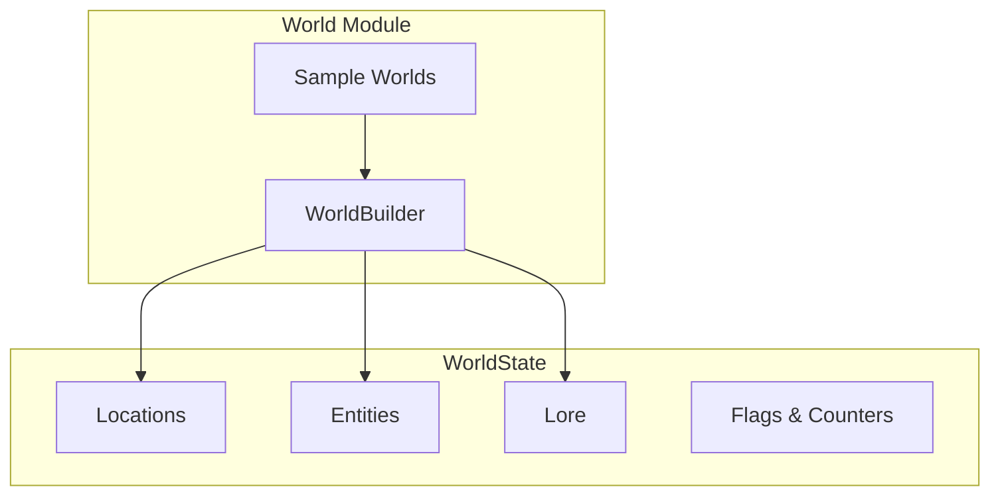

# World Model

The world model defines the structure for locations, entities, and lore that make up the game world.

## Architecture



## WorldState Structure

```typescript
// shared/src/types.ts

interface WorldState {
  id: string;
  name: string;
  description: string;
  locations: Map<LocationId, Location>;
  entities: Map<EntityId, Entity>;
  flags: Map<string, boolean>;
  counters: Map<string, number>;
  lore: LoreEntry[];
}
```

## Locations

Physical places in the world:

```typescript
interface Location {
  id: LocationId;
  name: string;
  description: CanonicalDescription;
  connections: LocationConnection[];
  presentEntities: EntityId[];
  ambiance: AmbianceProfile;
}

interface CanonicalDescription {
  text: string;
  sensoryDetails?: {
    sight?: string;
    sound?: string;
    smell?: string;
    touch?: string;
  };
  hiddenDetails?: string[];
}

interface LocationConnection {
  targetId: LocationId;
  direction: string;
  description?: string;
  isHidden?: boolean;
  requiredCondition?: string;
}

interface AmbianceProfile {
  lighting: 'bright' | 'dim' | 'dark';
  noise: 'quiet' | 'moderate' | 'loud';
  mood: 'peaceful' | 'tense' | 'eerie' | 'chaotic' | 'neutral';
  temperature?: 'cold' | 'cool' | 'comfortable' | 'warm' | 'hot';
}
```

### Example Location

```typescript
const tavern: Location = {
  id: createLocationId('loc-rusty-dragon'),
  name: 'The Rusty Dragon Inn',
  description: {
    text: 'A warm, inviting tavern with a crackling fireplace and the smell of roasting meat.',
    sensoryDetails: {
      sight: 'Flickering candlelight illuminates wooden tables and a long bar.',
      sound: 'The murmur of conversation mixed with occasional laughter.',
      smell: 'Wood smoke, ale, and fresh bread.',
    },
    hiddenDetails: [
      'A trapdoor behind the bar leads to a secret cellar.',
    ],
  },
  connections: [
    {
      targetId: createLocationId('loc-market-square'),
      direction: 'east',
      description: 'Through the front door to Market Square',
    },
    {
      targetId: createLocationId('loc-secret-cellar'),
      direction: 'down',
      isHidden: true,
      requiredCondition: 'found_trapdoor',
    },
  ],
  presentEntities: [
    createEntityId('npc-bartender'),
    createEntityId('npc-mysterious-stranger'),
  ],
  ambiance: {
    lighting: 'dim',
    noise: 'moderate',
    mood: 'peaceful',
    temperature: 'warm',
  },
};
```

## Entities

Everything in the world that isn't a location:

```typescript
type EntityType = 'npc' | 'creature' | 'item' | 'faction';

interface BaseEntity {
  id: EntityId;
  type: EntityType;
  name: string;
  description: CanonicalDescription;
}
```

### NPCs

Non-player characters with personality:

```typescript
interface NPCEntity extends BaseEntity {
  type: 'npc';
  personality: PersonalityProfile;
  knowledge: string[];
  motivation: string;
  attitude: 'friendly' | 'neutral' | 'hostile' | 'fearful';
  stats?: CreatureStats;
}

interface PersonalityProfile {
  traits: string[];
  ideals: string[];
  bonds: string[];
  flaws: string[];
  speakingStyle?: string;
  mannerisms?: string[];
}
```

### Creatures

Monsters and animals:

```typescript
interface CreatureEntity extends BaseEntity {
  type: 'creature';
  stats: CreatureStats;
  attitude: 'friendly' | 'neutral' | 'hostile' | 'fearful';
}
```

### Items

Physical objects:

```typescript
interface ItemEntity extends BaseEntity {
  type: 'item';
  itemType: 'weapon' | 'armor' | 'consumable' | 'treasure' | 'misc' | 'tool' | 'gear';
  value?: number;
  weight?: number;
  magical?: boolean;
  properties?: string[];
}
```

### Factions

Groups and organizations:

```typescript
interface FactionEntity extends BaseEntity {
  type: 'faction';
  alignment?: string;
  goals: string[];
  relationships: FactionRelationship[];
}

interface FactionRelationship {
  factionId: EntityId;
  attitude: 'allied' | 'friendly' | 'neutral' | 'rival' | 'hostile';
}
```

## Lore

World background information:

```typescript
interface LoreEntry {
  id: string;
  category: string;
  content: string;
  isPublicKnowledge: boolean;
  relatedEntities?: EntityId[];
}
```

## Flags and Counters

Track world state changes:

```typescript
// Flags for binary state
worldState.flags.set('dragon_defeated', true);
worldState.flags.set('found_trapdoor', false);

// Counters for numeric state
worldState.counters.set('days_passed', 5);
worldState.counters.set('goblin_raids', 3);
```

## WorldBuilder

Create worlds programmatically:

```typescript
// domain/src/world/world-builder.ts

class WorldBuilder {
  private world: Partial<WorldState>;
  
  constructor(name: string) {
    this.world = {
      id: `world-${Date.now()}`,
      name,
      locations: new Map(),
      entities: new Map(),
      flags: new Map(),
      counters: new Map(),
      lore: [],
    };
  }
  
  setDescription(description: string): this {
    this.world.description = description;
    return this;
  }
  
  addLocation(location: Location): this {
    this.world.locations!.set(location.id, location);
    return this;
  }
  
  addEntity(entity: Entity): this {
    this.world.entities!.set(entity.id, entity);
    return this;
  }
  
  addLore(entry: LoreEntry): this {
    this.world.lore!.push(entry);
    return this;
  }
  
  setFlag(name: string, value: boolean): this {
    this.world.flags!.set(name, value);
    return this;
  }
  
  setCounter(name: string, value: number): this {
    this.world.counters!.set(name, value);
    return this;
  }
  
  build(): WorldState {
    return this.world as WorldState;
  }
}
```

### Usage

```typescript
import { WorldBuilder } from '@ai-dm/domain';

const world = new WorldBuilder('The Lost Kingdom')
  .setDescription('A once-great realm now fallen to darkness')
  .addLocation(tavern)
  .addLocation(marketSquare)
  .addEntity(bartender)
  .addEntity(mysteriousStranger)
  .addLore({
    id: 'lore-1',
    category: 'History',
    content: 'A thousand years ago, the kingdom fell to the Shadow Dragon.',
    isPublicKnowledge: true,
  })
  .build();
```

## Sample Worlds

Pre-built worlds for testing:

```typescript
// domain/src/world/sample-worlds.ts

export function createTavernWorld(): WorldState {
  // Returns a complete tavern scene for quick testing
}

export function createDungeonWorld(): WorldState {
  // Returns a dungeon crawl setup
}
```

## Related Documentation

- [World Overlay System](World-Overlay-System.md) - Adapting worlds to settings
- [Campaign System](Campaign-System.md) - Story integration
- [NPC Relationships](NPC-Relationships.md) - NPC memory
- [Domain Model](../architecture/Domain-Model.md) - Entity types
