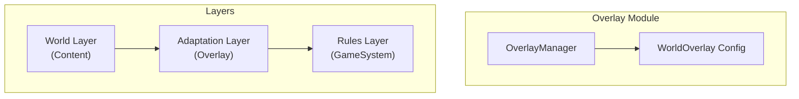

# World Overlay System

The world overlay system adapts D&D 5e mechanics to different campaign settings through terminology mapping, feature restrictions, and DM guidance injection.

## Architecture



## Three-Layer Architecture

```
┌─────────────────────────────────────┐
│  WORLD LAYER (Content)              │
│  - Locations, NPCs, lore, factions  │
├─────────────────────────────────────┤
│  ADAPTATION LAYER (Overlay)         │
│  - Terminology mapping              │
│  - Feature restrictions/reskins     │
│  - DM guidance injection            │
├─────────────────────────────────────┤
│  RULES LAYER (GameSystem)           │
│  - Core mechanics (D&D 5e)          │
└─────────────────────────────────────┘
```

## WorldOverlay Structure

```typescript
// domain/src/overlay/world-overlay.ts

interface WorldOverlay {
  id: string;
  name: string;
  description: string;
  
  /** Terminology remapping */
  terminology: TerminologyMapping;
  
  /** Race/class restrictions or reskins */
  characterOptions: CharacterOptionOverrides;
  
  /** Custom monsters, items, spells */
  customContent: CustomContent;
  
  /** DM guidance for tone and style */
  dmGuidance: DMGuidance;
  
  /** Overlay to inherit from */
  extends?: string;
}
```

## Terminology Mapping

Remap D&D terms to setting-specific language:

```typescript
interface TerminologyMapping {
  /** Currency names */
  currency?: {
    gold?: string;      // "gold" → "credits"
    silver?: string;
    copper?: string;
  };
  
  /** Magic terminology */
  magic?: {
    spell?: string;     // "spell" → "power"
    cantrip?: string;
    spellSlot?: string;
  };
  
  /** Class names */
  classes?: Record<string, string>;   // "wizard" → "technomancer"
  
  /** Race names */
  races?: Record<string, string>;     // "dwarf" → "mech-born"
  
  /** Equipment types */
  equipment?: Record<string, string>; // "longsword" → "energy blade"
  
  /** Generic terms */
  generic?: Record<string, string>;
}
```

### Example: Sci-Fi Overlay

```json
{
  "terminology": {
    "currency": {
      "gold": "credits",
      "silver": "half-credits",
      "copper": "bits"
    },
    "magic": {
      "spell": "power",
      "cantrip": "minor power",
      "spellSlot": "energy reserve"
    },
    "classes": {
      "wizard": "technomancer",
      "fighter": "soldier",
      "cleric": "medic",
      "rogue": "operative"
    },
    "races": {
      "elf": "androidi",
      "dwarf": "mech-born",
      "human": "terran"
    }
  }
}
```

## Character Options

Restrict or reskin character choices:

```typescript
interface CharacterOptionOverrides {
  /** Races available in this setting */
  allowedRaces?: string[];
  
  /** Classes available in this setting */
  allowedClasses?: string[];
  
  /** Race reskins (mechanical same, flavor different) */
  raceReskins?: Record<string, {
    newName: string;
    description: string;
    flavorTraits?: string[];
  }>;
  
  /** Class reskins */
  classReskins?: Record<string, {
    newName: string;
    description: string;
  }>;
}
```

### Example: Dark Fantasy Restrictions

```json
{
  "characterOptions": {
    "allowedRaces": ["human", "half-orc", "tiefling"],
    "allowedClasses": ["fighter", "rogue", "warlock"],
    "raceReskins": {
      "tiefling": {
        "newName": "Hellspawn",
        "description": "Cursed descendants of those who made dark pacts",
        "flavorTraits": ["Marked by darkness", "Distrusted by common folk"]
      }
    }
  }
}
```

## Custom Content

Add setting-specific content:

```typescript
interface CustomContent {
  /** Additional monsters */
  monsters?: Record<string, CreatureEntity>;
  
  /** Setting-specific items */
  items?: Record<string, ItemEntity>;
  
  /** New or modified spells */
  spells?: Record<string, SpellInfo>;
  
  /** Setting-specific factions */
  factions?: Record<string, FactionEntity>;
}
```

## DM Guidance

Influence DM narration and rulings:

```typescript
interface DMGuidance {
  /** Overall tone */
  tone: 'comedic' | 'serious' | 'dark' | 'epic' | 'mysterious';
  
  /** Themes to emphasize */
  themes: string[];
  
  /** Vocabulary to use/avoid */
  vocabulary: {
    preferred: string[];
    avoided: string[];
  };
  
  /** Naming conventions */
  namingConventions: {
    npcs?: string;       // "Use Germanic names"
    locations?: string;
    items?: string;
  };
  
  /** Setting-specific rules guidance */
  rulesGuidance?: string[];
  
  /** Narrative hooks to weave in */
  narrativeHooks?: string[];
}
```

### Example: Dark Fantasy Guidance

```json
{
  "dmGuidance": {
    "tone": "dark",
    "themes": [
      "corruption",
      "moral ambiguity",
      "survival",
      "the cost of power"
    ],
    "vocabulary": {
      "preferred": ["grim", "bleak", "cursed", "tainted", "desperate"],
      "avoided": ["cheerful", "whimsical", "magical", "wonderful"]
    },
    "namingConventions": {
      "npcs": "Use harsh, Germanic-inspired names",
      "locations": "Descriptive of decay or danger"
    },
    "rulesGuidance": [
      "Healing is scarce - potions are rare and expensive",
      "Death is permanent - resurrection magic doesn't exist",
      "Light sources are precious in the eternal twilight"
    ]
  }
}
```

## OverlayManager

Applies overlays to game elements:

```typescript
// domain/src/overlay/overlay-manager.ts

class OverlayManager {
  constructor(private overlay: WorldOverlay) {}
  
  /** Apply terminology mapping to text */
  applyTerminology(text: string): string {
    let result = text;
    
    // Apply all mappings
    for (const [original, replacement] of Object.entries(this.getAllMappings())) {
      const regex = new RegExp(`\\b${original}\\b`, 'gi');
      result = result.replace(regex, replacement);
    }
    
    return result;
  }
  
  /** Check if race is allowed */
  isRaceAllowed(raceKey: string): boolean {
    const allowed = this.overlay.characterOptions?.allowedRaces;
    return !allowed || allowed.includes(raceKey);
  }
  
  /** Get race display name */
  getRaceDisplayName(raceKey: string): string {
    return this.overlay.terminology?.races?.[raceKey] ?? raceKey;
  }
  
  /** Get DM guidance for system prompt */
  getDMGuidancePrompt(): string {
    const guidance = this.overlay.dmGuidance;
    
    return `
## Setting Guidance

Tone: ${guidance.tone}
Themes: ${guidance.themes.join(', ')}

Preferred vocabulary: ${guidance.vocabulary.preferred.join(', ')}
Avoid: ${guidance.vocabulary.avoided.join(', ')}

Naming conventions:
${Object.entries(guidance.namingConventions).map(([k, v]) => `- ${k}: ${v}`).join('\n')}

Rules modifications:
${guidance.rulesGuidance?.map(r => `- ${r}`).join('\n') ?? 'None'}
    `.trim();
  }
}
```

## Built-in Overlays

| Overlay | Setting | Key Changes |
|---------|---------|-------------|
| `dark-fantasy` | Grimdark | Harsh tone, limited healing, moral ambiguity |
| `sci-fi-reskin` | Space opera | Reskinned terminology, tech-flavored magic |

## Creating Custom Overlays

```json
// data/overlays/my-setting.json
{
  "id": "my-setting",
  "name": "My Custom Setting",
  "description": "A unique world...",
  "terminology": {...},
  "characterOptions": {...},
  "dmGuidance": {...}
}
```

## Related Documentation

- [World Model](World-Model.md) - World structure
- [Game System Abstraction](../core-systems/Game-System-Abstraction.md) - Rules layer
- [DM Personas](../core-systems/DM-Personas.md) - Persona interaction
